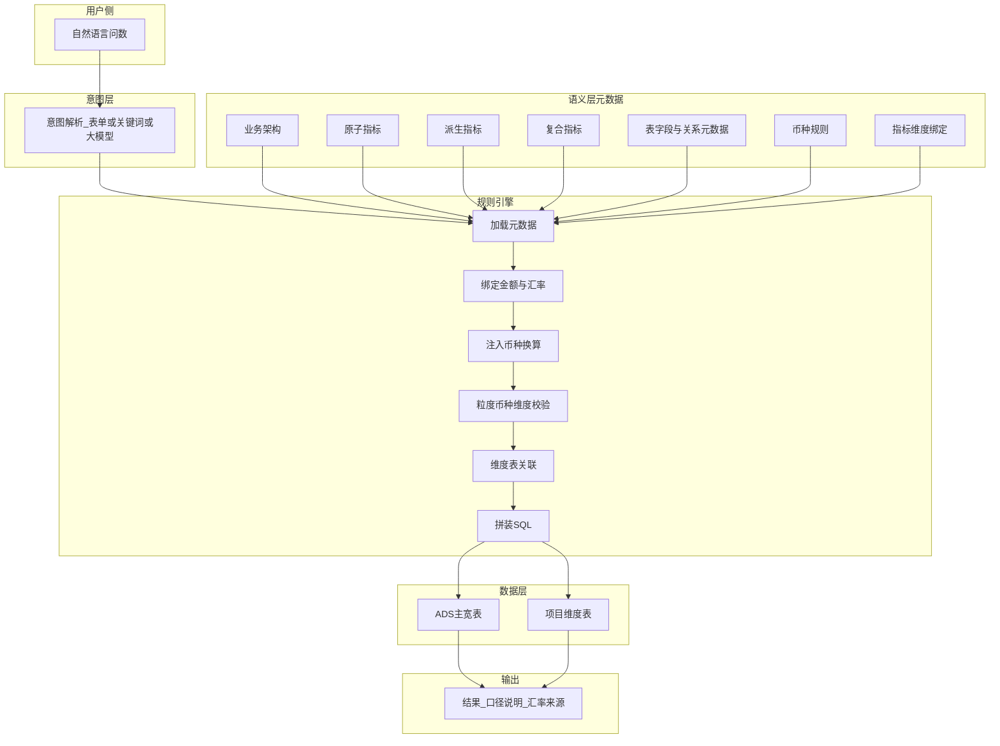
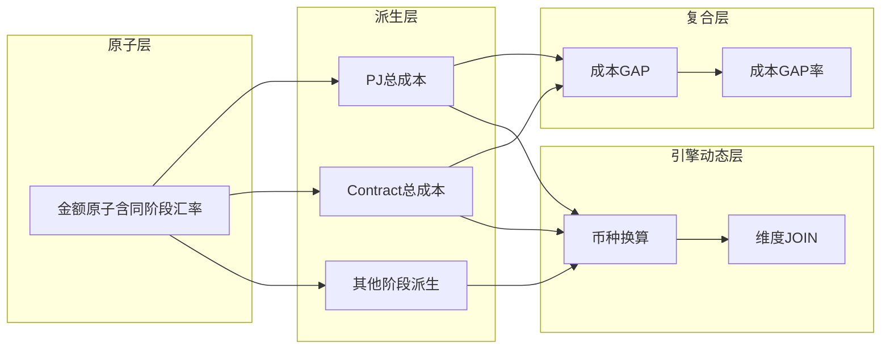
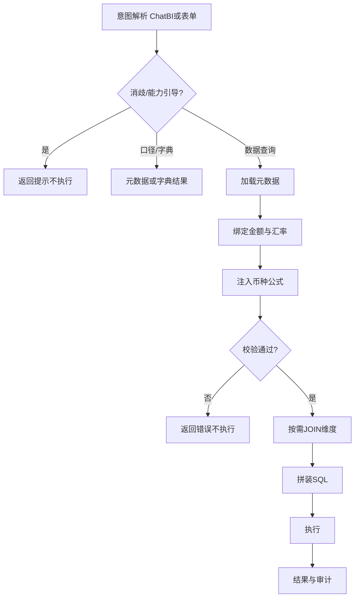

# 指标配置管理 · 规则引擎 Text-to-SQL Demo

Python + Flask + SQLite。语义层元数据驱动，AI/意图层只出结构化意图，规则引擎生成并执行 SQL。

## 文档（拆库带走）


| 文档                                                 | 内容                  |
| -------------------------------------------------- | ------------------- |
| [doc/README.md](doc/README.md)                     | 文档索引                |
| [doc/01_技术方案.md](doc/01_技术方案.md)                   | 架构与问数链路             |
| [doc/02_计算与币种规则.md](doc/02_计算与币种规则.md)             | 五阶段汇率、币种、复合验算       |
| [doc/03_元数据与配置模型.md](doc/03_元数据与配置模型.md)           | 表结构与绑定模型            |
| [doc/04_Demo实现与拆库说明.md](doc/04_Demo实现与拆库说明.md)     | 代码映射与独立建库步骤         |
| [doc/05_详细设计_Flask与实现.md](doc/05_详细设计_Flask与实现.md) | Flask/Web 入门与工程详细设计 |


## 能力

- **指标管理**统一入口（`/metrics`）：原子 / 派生 / 复合三类卡片 + 列表 Tab；紧凑表省略展示
- 业务架构主数据（业务线 → 主题域 → 业务对象 → 业务过程）
- 表/字段元数据 + 事实↔维度关系；分析维度来自字段勾选（`is_analysis_dim`）+ 指标绑定
- 原子：绑定物理字段、尽量少写过滤；自动/手工 SQL；阶段汇率字段在原子层维护
- 派生：原子 + 业务切片；金额/汇率/分类继承自原子
- 复合：同粒度四则运算（如 `(A+B)/C`）；粒度/币种校验
- 指标地图：复合向下展开依赖树
- 规则引擎：阶段汇率绑定、币种注入、粒度/维度校验、JOIN、复合先换算再运算
- 问数：结构化表单，或自然语言（ChatBI 意图流水线：词典 Mapper + 百炼/规则兜底 + 校验消歧；失败回退旧百炼/关键词；关联指标按血缘展开）→ SQL 或元数据说明


## 启动

```bash
python -m venv .venv

# Windows
.\.venv\Scripts\pip install -r requirements.txt
# 配置百炼（可选）：复制 .env.example 为 .env，填写 DASHSCOPE_API_KEY / BASE_URL
.\.venv\Scripts\python app.py

# macOS / Linux
# .venv/bin/pip install -r requirements.txt
# .venv/bin/python app.py
```

浏览器：[http://127.0.0.1:5050](http://127.0.0.1:5050)  

首次启动自动建库灌种（`data/demo.db`，已 gitignore）。

### 百炼意图（自然语言模式）


| 环境变量                 | 说明                                                                                    |
| -------------------- | ------------------------------------------------------------------------------------- |
| `DASHSCOPE_API_KEY`  | 百炼 API Key（未配置则只用关键词）                                                                 |
| `DASHSCOPE_BASE_URL` | OpenAI 兼容地址，如 `https://{WorkspaceId}.cn-beijing.maas.aliyuncs.com/compatible-mode/v1` |
| `DASHSCOPE_MODEL`    | 默认 `qwen-plus`                                                                        |
| `INTENT_PROVIDER`    | `auto`（默认，ChatBI 主链路）/ `chatbi` / `bailian` / `keyword`                               |


密钥放在本地 `.env`（已 gitignore），勿提交仓库。模型只输出 Intent JSON，SQL 仍由规则引擎生成。

## 推荐演示

1. **问数 Demo** → 选「自然语言」→ 问句如「查询项目P001的成本GAP，人民币，带电站」
2. 意图来源应显示「阿里云百炼」（已配 Key）或「关键词」
3. 核对 SQL：各阶段先乘本阶段汇率再相减；期望 GAP **1540**（详见 [doc/02](doc/02_计算与币种规则.md)）


## 目录

```text
app.py / db.py / engine.py / intent.py / intent_chatbi.py / intent_llm.py / display.py
meta.py / biz_arch.py / metric_sql.py / metric_map.py
chatbi/  templates/  static/  data/  doc/  requirements.txt  .env.example
```


## 边界

不接生产数仓；公式为子指标名 + 四则运算；无登录权限。扩展方式见 [doc/04](doc/04_Demo实现与拆库说明.md)。

# 01 · 技术方案：语义层元数据 + 规则引擎 Text-to-SQL


## 1. 目标与边界


| 项      | 说明                                  |
| ------ | ----------------------------------- |
| 目标     | 自然语言问数结果与指标平台口径 **100% 一致**，可审计、可追溯 |
| AI 边界  | **只做意图识别**，不生成业务 SQL、不写口径、不计算       |
| SQL 来源 | 规则引擎根据元数据拼装                         |
| 典型场景   | 财务 Tracker 五阶段成本对比 × 多币种 × 项目分析维度   |


## 2. 架构原则（不可改动）


| #   | 原则       | 说明                       |
| --- | -------- | ------------------------ |
| 1   | AI 只做意图  | 输出结构化意图：指标、币种、维度、筛选      |
| 2   | 元数据驱动    | 聚合、过滤、关联、币种、阶段隔离全部引擎化    |
| 3   | 口径固化     | 原子 / 派生 / 复合配置后，AI 不得重解释 |
| 4   | 禁止临时 SQL | 多阶段、多币种、多表关联一律标准化模板      |


## 3. 分层结构


| 层级  | 名称          | 职责                                           | 对外  |
| --- | ----------- | -------------------------------------------- | --- |
| 底层  | 原子指标        | 绑定物理字段与基础业务属性；阶段金额/汇率在本层维护；**尽量不写 WHERE**    | 否   |
| 中层  | 派生指标        | 原子 + 业务切片（时间/修饰词等分析维度与可选过滤）；默认继承原子元数据        | 是   |
| 高层  | 复合指标        | 同粒度子指标四则运算（如 `(A+B)/C`）；校验业务归属/粒度/币种一致       | 是   |
| 配置层 | 表元数据 + 维度绑定 | 事实/维度表字段（含「用于分析维度」）经 `metric_dim_bind` 绑定到指标 | 配置  |
| 分类层 | 业务架构        | 业务线 → 主题域 → 业务对象 → 业务过程，供指标落库引用              | 配置  |
| 动态层 | 规则引擎        | 运行时币种注入、校验、JOIN、拼 SQL                        | —   |


三类指标在 Demo 中统一归入 **指标管理** 模块（`/metrics` 卡片入口 + 列表页 Tab 切换；支持关键词查询与原子→派生→复合快捷创建）。  
**指标地图**以业务架构为根挂载依赖树，用于配置可视化（不参与 SQL）。

## 4. 系统架构




## 5. 指标依赖关系




说明：汇率不再单独做成「汇率原子」；**金额原子上维护** `stage_type` **+** `rate_col`，派生只读继承。

## 6. 端到端问数链路


| 步骤  | 动作            | 输出                                          |
| --- | ------------- | ------------------------------------------- |
| 1   | 意图解析（无业务 SQL） | ChatBI：Mapper → LLM/规则 → 校验/消歧 → 三类意图之一；或表单 |
| 1b  | 交互拦截（可选）      | 多指标消歧反问；未识别则能力引导（数据查询/口径/字典）                |
| 1c  | 非查询分流         | 口径咨询 → 指标元数据；字典检索 → 清单                      |
| 2   | 加载元数据         | 派生/复合配置、维度绑定、表关系                            |
| 3   | 阶段映射          | 自原子取金额列 + 同前缀汇率列                            |
| 4   | 币种注入          | CNY / USD / 原币表达式                           |
| 5   | 校验            | 粒度一致、币种一致、维度已绑定                             |
| 6   | 关联            | 需要时按 `meta_table_rel` 生成 `LEFT JOIN`        |
| 7   | 拼 SQL         | 可执行语句（仅数据查询）                                |
| 8   | 执行 + 审计       | 结果行 + 中文口径说明                                |


工程细节见 [05_详细设计 §10](05_详细设计_Flask与实现.md)。




## 7. 全局禁止规则


| #   | 禁止项                          | 原因                       |
| --- | ---------------------------- | ------------------------ |
| 1   | AI 直接 NL2SQL / 自定义口径         | 不可审计                     |
| 2   | 跨阶段汇率混用                      | 财务串数                     |
| 3   | 复合先算差再统一乘汇率                  | 各阶段汇率不同                  |
| 4   | 原子层随意写 GROUP BY / 复杂聚合 WHERE | 破坏「绑定物理字段」约定；过滤尽量下沉到派生切片 |
| 5   | 不同粒度混合运算                     | 笛卡尔积 / 重复计算              |
| 6   | 使用未绑定到指标的分析维度                | 口径越权                     |


## 8. 评审结论

采用**语义层元数据驱动 + 规则引擎生成 SQL**。AI 仅意图识别；五阶段独立汇率通过「原子层金额字段 ↔ 同前缀汇率」强制绑定；分析维度通过表字段元数据（`is_analysis_dim`）+ 指标绑定受控透出。满足财务准确性、可审计、可追溯要求。

---

关联文档：[02_计算与币种规则.md](02_计算与币种规则.md) · [03_元数据与配置模型.md](03_元数据与配置模型.md)