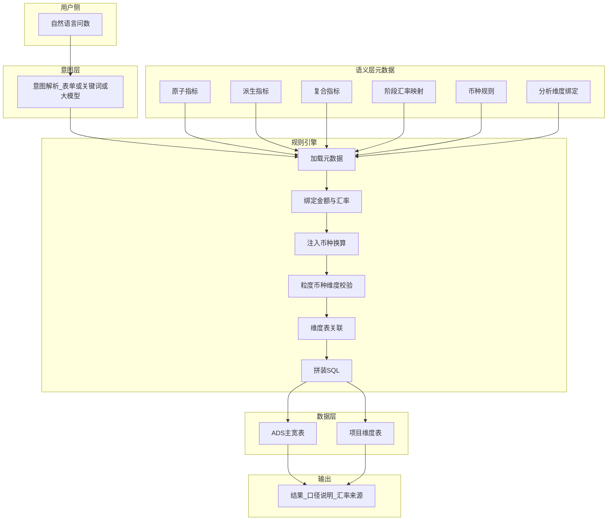
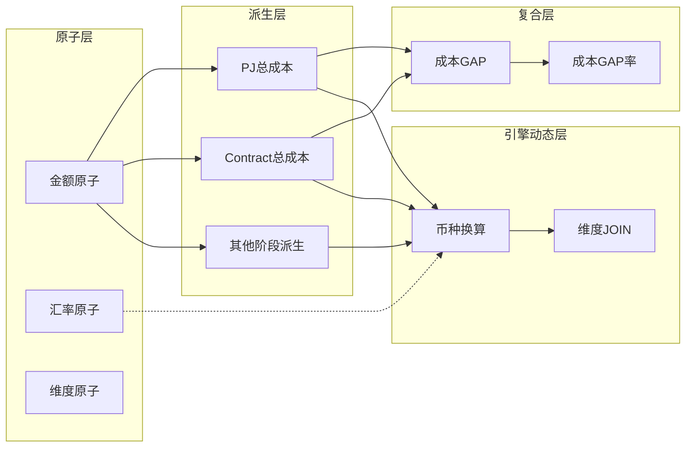
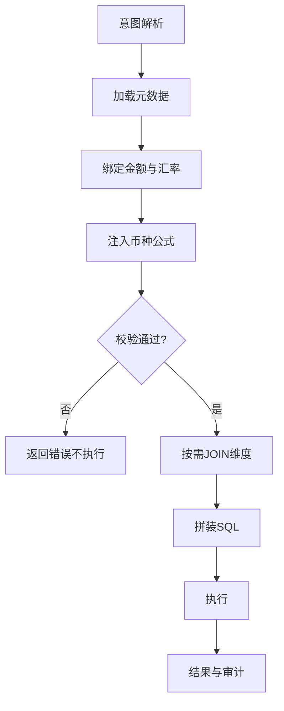

# 01 · 技术方案：语义层元数据 + 规则引擎 Text-to-SQL

## 1. 目标与边界

| 项 | 说明 |
|---|---|
| 目标 | 自然语言问数结果与指标平台口径 **100% 一致**，可审计、可追溯 |
| AI 边界 | **只做意图识别**，不生成业务 SQL、不写口径、不计算 |
| SQL 来源 | 规则引擎根据元数据拼装 |
| 典型场景 | 财务 Tracker 五阶段成本对比 × 多币种 × 项目分析维度 |

## 2. 架构原则（不可改动）

| # | 原则 | 说明 |
|---|---|---|
| 1 | AI 只做意图 | 输出结构化意图：指标、币种、维度、筛选 |
| 2 | 元数据驱动 | 聚合、过滤、关联、币种、阶段隔离全部引擎化 |
| 3 | 口径固化 | 原子 / 派生 / 复合配置后，AI 不得重解释 |
| 4 | 禁止临时 SQL | 多阶段、多币种、多表关联一律标准化模板 |

## 3. 分层结构

| 层级 | 名称 | 职责 | 对外 |
|---|---|---|---|
| 底层 | 原子指标 | 单表原始字段，无 WHERE / 计算 / 汇率 | 否 |
| 中层 | 派生指标 | 阶段切片、口径固化、粒度锁定 | 是 |
| 高层 | 复合指标 | 公式 + 子指标（GAP / GAP率等） | 是 |
| 配置层 | 分析维度 | 粒度维 + 分析展示维，与指标绑定 | 配置 |
| 动态层 | 规则引擎 | 运行时币种注入、校验、JOIN、拼 SQL | — |

## 4. 系统架构

## 5. 指标依赖关系

## 6. 端到端问数链路

| 步骤 | 动作 | 输出 |
|---|---|---|
| 1 | 意图解析（无业务 SQL） | 指标、币种、分析维度、筛选 |
| 2 | 加载元数据 | 派生/复合配置、维度绑定 |
| 3 | 阶段映射 | 金额列 + 同前缀汇率列 |
| 4 | 币种注入 | CNY / USD / 原币表达式 |
| 5 | 校验 | 粒度一致、币种一致、维度已绑定 |
| 6 | 关联 | 需要时 `LEFT JOIN` 维度表 |
| 7 | 拼 SQL | 可执行语句 |
| 8 | 执行 + 审计 | 结果行 + 中文口径说明 |

## 7. 全局禁止规则

| # | 禁止项 | 原因 |
|---|---|---|
| 1 | AI 直接 NL2SQL / 自定义口径 | 不可审计 |
| 2 | 跨阶段汇率混用 | 财务串数 |
| 3 | 复合先算差再统一乘汇率 | 各阶段汇率不同 |
| 4 | 原子写 GROUP BY / SUM / WHERE | 破坏裸字段约定 |
| 5 | 不同粒度混合运算 | 笛卡尔积 / 重复计算 |
| 6 | 使用未绑定到指标的分析维度 | 口径越权 |

## 8. 评审结论

采用**语义层元数据驱动 + 规则引擎生成 SQL**。AI 仅意图识别；五阶段独立汇率通过「字段前缀 ↔ 同前缀汇率」强制绑定；分析维度通过主数据 + 指标绑定受控透出。满足财务准确性、可审计、可追溯要求。

---

关联文档：[02_计算与币种规则.md](02_计算与币种规则.md) · [03_元数据与配置模型.md](03_元数据与配置模型.md)
