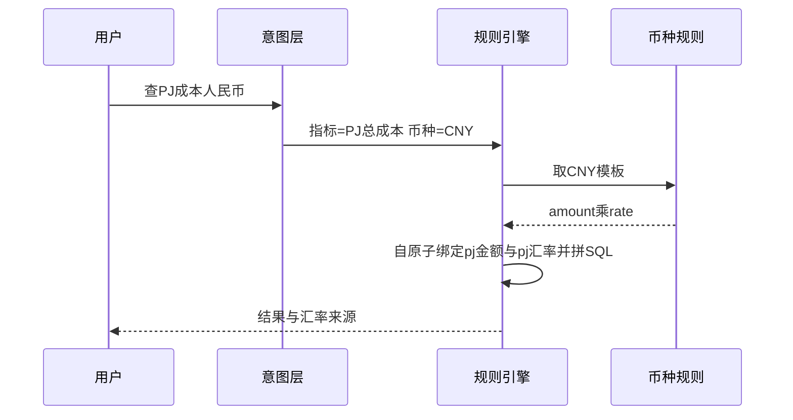
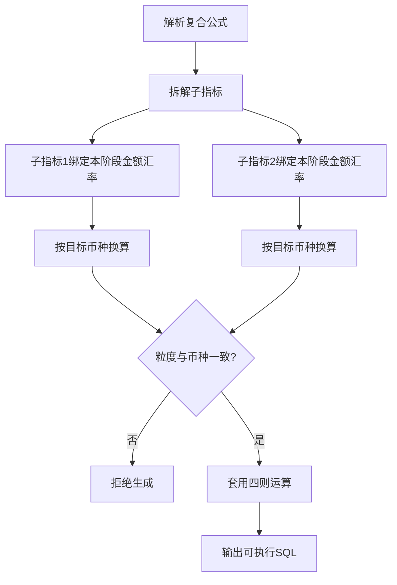

# 02 · 计算与币种规则

## 1. 业务底座（样例 / 生产同构逻辑）

### 1.1 主宽表粒度

- 表：`ads_fin_tracker_comparison_summary_df`（Demo 内 SQLite 同名）
- 粒度：`project_number` 唯一（一项目一行）
- 规则：**阶段成本必须搭配同前缀阶段汇率**，禁止跨阶段混用

### 1.2 五阶段字段映射

| 业务阶段 | 外币金额字段 | 对应汇率字段 |
|---|---|---|
| PJ | `pj_total_cost` | `pj_exchange_rate` |
| Contract | `contract_total_cost` | `contract_exchange_rate` |
| Target | `target_total_cost` | `target_exchange_rate` |
| YTD | `ytd_total_cost` | `ytd_exchange_rate` |
| FinalCST | `finalcst_total_cost` | `finalcst_exchange_rate` |

上述映射在 **原子指标** 上维护（`stage_type` + `source_field` + `rate_col`）；派生只读继承。

### 1.3 维度表

| 项 | 值 |
|---|---|
| 表 | `dim_project` |
| 主键 | `project_number` |
| 常用属性 | `project_name`、`power_plant`、`region` |
| 关联 | 由 `meta_table_rel` 配置；引擎生成 `LEFT JOIN ... ON m.project_number = d.project_number` |

---

## 2. 币种换算（引擎内置，不写死在指标）

| 目标币种 | 模板表达式 | 含义 |
|---|---|---|
| CNY（默认汇报） | `COALESCE(amount,0) * COALESCE(rate,1)` | 外币 × 阶段汇率 |
| USD | `COALESCE(amount,0) / COALESCE(rate,1)` | 外币 ÷ 阶段汇率 |
| ORIGIN 原币 | `COALESCE(amount,0)` | 不换算 |

要点：

1. 意图只给出目标币种；
2. 引擎从**原子指标**取出金额字段 `source_field` 与同阶段 `rate_col`（派生只继承），再注入模板；
3. 原子/派生过滤编译为 `CASE WHEN … THEN 金额 END` 后参与换算；
4. 指标配置本身不存死汇率、不死公式。



---

## 3. 派生指标计算口径

派生 = 选定阶段**金额原子**（含同阶段汇率字段维护）+ 业务切片（绑定分析维度）+ 可选叠加过滤；字段前缀隔离，一般无需 stage WHERE。

| 派生示例 | 来源原子金额列 | 原子汇率列 | 粒度 |
|---|---|---|---|
| PJ总成本 | `pj_total_cost` | `pj_exchange_rate` | project_number |
| Contract总成本 | `contract_total_cost` | `contract_exchange_rate` | project_number |

CNY 展开示例：

```sql
COALESCE(m.pj_total_cost, 0) * COALESCE(m.pj_exchange_rate, 1)
```

---

## 4. 复合指标计算口径（强制顺序）

**正确**：各子指标先按**各自阶段汇率**换算到目标币种 → 再做四则运算。  
**错误**：先算外币差值 → 再统一乘某一个汇率。

同粒度、业务归属一致方可运算（如 `(A+B)/C`）；引擎可按配置校验粒度/币种。

### 4.1 标准公式

| 复合指标 | 公式 | 依赖 |
|---|---|---|
| 成本GAP | `Contract总成本 - PJ总成本` | 两个派生 |
| 成本GAP率 | `成本GAP / Contract总成本` | 复合 + 派生 |

### 4.2 引擎展开（CNY）

```sql
(
  COALESCE(m.contract_total_cost,0) * COALESCE(m.contract_exchange_rate,1)
  -
  COALESCE(m.pj_total_cost,0) * COALESCE(m.pj_exchange_rate,1)
) AS cmp_cost_gap
```

### 4.3 生成流程



---

## 5. Demo 样例验算（P001 · CNY）

种子数据：

| 项目 | PJ成本 | PJ汇率 | Contract成本 | Contract汇率 |
|---|---:|---:|---:|---:|
| P001 | 1000 | 7.1 | 1200 | 7.2 |

计算：

| 步骤 | 算式 | 结果 |
|---|---|---:|
| Contract CNY | 1200 × 7.2 | 8640 |
| PJ CNY | 1000 × 7.1 | 7100 |
| 成本GAP | 8640 − 7100 | **1540** |
| 成本GAP率 | 1540 / 8640 | ≈ 0.1782 |

若错误地「先差后乘」例如 `(1200−1000)×7.2 = 1440`，与正确口径不一致——引擎必须杜绝该路径。

---

## 6. 分析维度与筛选

| 角色 | 含义 | 示例 |
|---|---|---|
| 粒度（grain） | 指标聚合粒度，默认输出 | `project_number`（来自事实表 `grain_keys` / 字段语义） |
| 分析（attr） | 问数可选附加列，须绑定到指标 | `power_plant`、`region`（`meta_field.is_analysis_dim=1`） |

绑定关系存于 `metric_dim_bind`（`dim_id` 指向 `meta_field.id`）。多指标同时查询时：请求的分析维度必须属于各指标绑定集合的**交集**。

筛选：按字段来源表生成 WHERE；维度表字段触发 JOIN（依据 `meta_table_rel`）。

---

## 7. 空值容错

金额、汇率一律 `COALESCE(..., 0|1)`，避免 NULL 传染导致整行结果为空。

---

关联文档：[01_技术方案.md](01_技术方案.md) · [03_元数据与配置模型.md](03_元数据与配置模型.md)
