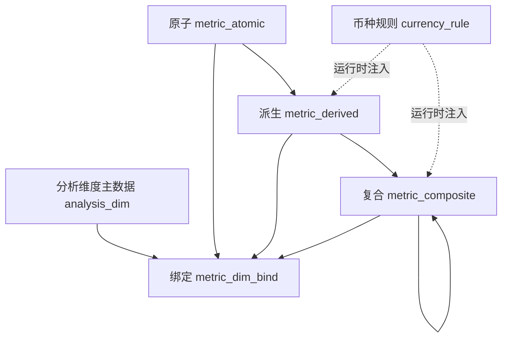

# 03 · 元数据与配置模型

## 1. 概念总览

---

## 2. 分析维度主数据 `analysis_dim`

| 字段 | 说明 |
|---|---|
| id | 主键，如 `dim_power_plant` |
| code | 问数勾选编码，如 `power_plant` |
| name | 中文名，如「电站」 |
| source_table | 来源表：`ads_...` 或 `dim_project` |
| source_field | 物理字段名 |
| dim_role | `grain` 粒度 / `attr` 分析展示 |
| enabled | 是否启用 |
| sort_no | 排序 |
| remark | 备注 |

预置示例：

| code | 名称 | 角色 | 来源 |
|---|---|---|---|
| project_number | 项目编号 | grain | 宽表 |
| power_plant | 电站 | attr | dim_project |
| region | 区域 | attr | dim_project |
| project_name | 项目名称 | attr | dim_project |

---

## 3. 指标维度绑定 `metric_dim_bind`

| 字段 | 说明 |
|---|---|
| metric_type | `atomic` / `derived` / `composite` |
| metric_id | 指标 ID |
| dim_id | 分析维度 ID |

约束：

- 原子、派生：**至少绑定一个 grain 维度**
- 问数附加维度：必须出现在所选指标绑定的 **attr 交集**中
- 删除维度前若仍有绑定则拒绝

---

## 4. 原子指标 `metric_atomic`

| 字段 | 说明 |
|---|---|
| id / name | 标识与名称 |
| source_table / source_field | 原始字段映射 |
| agg_type | 金额 SUM；文本维度 MAX/MIN |
| grain_dims | JSON，由绑定的 grain 维度同步回写 |
| remark | 备注 |

规则：不含 WHERE、计算、汇率、GROUP BY（配置层不写业务逻辑）。

---

## 5. 派生指标 `metric_derived`

| 字段 | 说明 |
|---|---|
| atomic_id | 来源原子 |
| stage_type | PJ / Contract / Target / YTD / FinalCST |
| amount_col | 阶段金额字段 |
| rate_col | **同前缀**汇率字段 |
| grain_dims | 由 grain 绑定同步 |
| exposed | 是否对外可问 |

---

## 6. 复合指标 `metric_composite`

| 字段 | 说明 |
|---|---|
| formula | 公式文本，使用子指标中文名 |
| sub_metric_ids | 子指标 ID 数组（JSON） |
| check_currency_same | 强制币种一致 |
| check_granularity_same | 强制粒度一致 |

公式能力（Demo）：子指标名 + `+ - * /` 与括号；支持嵌套复合（如 GAP率引用 GAP）。

---

## 7. 币种规则 `currency_rule`

| code | name | expr_template |
|---|---|---|
| CNY | 人民币 | `COALESCE({amount},0) * COALESCE({rate},1)` |
| USD | 美元 | `COALESCE({amount},0) / COALESCE({rate},1)` |
| ORIGIN | 原币 | `COALESCE({amount},0)` |

占位符 `{amount}` / `{rate}` 由引擎替换为带表别名的列引用。

---

## 8. 业务样例表（仅 Demo 执行用）

- `ads_fin_tracker_comparison_summary_df`：五阶段金额与汇率
- `dim_project`：项目属性

生产环境可替换为真实仓外表查询；**元数据模型与计算规则保持不变**。

---

## 9. Web 配置入口（Demo）

| 页面 | 能力 |
|---|---|
| `/dims` | 分析维度 CRUD |
| `/metrics/atomic` | 原子 + 维度绑定 |
| `/metrics/derived` | 派生 + 阶段汇率 + 维度绑定 |
| `/metrics/composite` | 复合公式 + 子指标 + 维度绑定 |
| `/ask` | 意图 → SQL → 执行 → 中文审计 |

---

关联文档：[02_计算与币种规则.md](02_计算与币种规则.md) · [04_Demo实现与拆库说明.md](04_Demo实现与拆库说明.md)
