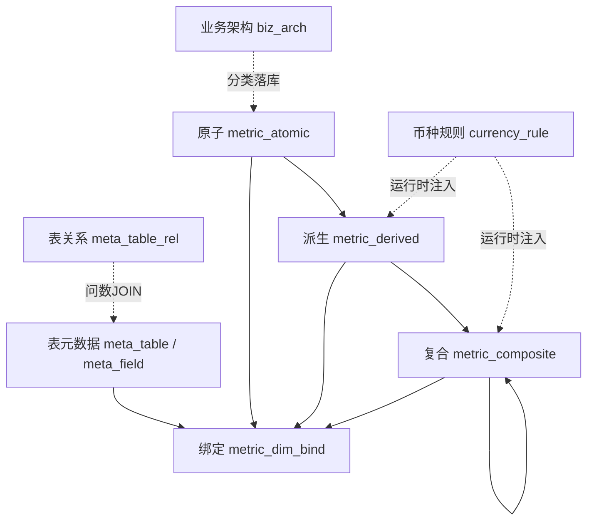

# 03 · 元数据与配置模型

## 1. 概念总览

配置顺序建议：**业务架构 → 表元数据 → 维度关系 → 指标管理（原子 → 派生 → 复合）→ 问数 / 指标地图**。

---

## 2. 分析维度（来自表字段元数据）

分析维度**不再单独维护一套 CRUD 页面**。可绑定字段来自 `meta_field`：

| 条件 | 说明 |
|---|---|
| `meta_field.is_analysis_dim = 1` | 勾选「用于分析维度」 |
| `enabled = 1` | 表与字段均启用 |
| 语义 | 通常 `grain` / `attr`；度量/汇率字段一般不参与绑定 |

预置示例（种子同步后）：

| 字段 code | 名称 | 角色倾向 | 来源表 |
|---|---|---|---|
| project_number | 项目编号 | grain | 事实宽表 |
| power_plant | 电站 | attr | dim_project |
| region | 区域 | attr | dim_project |
| project_name | 项目名称 | attr | dim_project |

> 历史表 `analysis_dim` 可能仍存在于库中作迁移兼容；**运行时绑定与问数均以 `meta_field` 为准**。

---

## 3. 指标维度绑定 `metric_dim_bind`

| 字段 | 说明 |
|---|---|
| metric_type | `atomic` / `derived` / `composite` |
| metric_id | 指标 ID |
| dim_id | **`meta_field.id`**（可绑定分析字段） |

约束：

- 原子、派生：**至少绑定一个 grain 维度**（语义为粒度的字段）
- 问数附加维度：必须出现在所选指标绑定的 **attr 交集**中

---

## 4. 原子指标 `metric_atomic`

| 字段 | 说明 |
|---|---|
| id / name | 标识与中文名称 |
| name_en | 英文名称（SQL 别名，如 `pj_total_cost`） |
| source_table / source_field | 原始字段映射（金额/度量） |
| agg_type | 金额 SUM；文本维度 MAX/MIN |
| stage_type | 业务阶段（PJ / Contract / …），金额类原子填写 |
| rate_col | **同阶段**汇率字段，在原子层维护 |
| filter_json | 过滤条件多行文本（SQL 谓词，不含 WHERE）；空=不过滤；**尽量少用** |
| sql_expr | 自动生成或手工改写的指标 SQL；默认 `SELECT m.字段 AS 英文名 FROM 表 m` |
| sql_manual | 1=手工改写（保存时不覆盖 sql_expr） |
| grain_dims | JSON，由绑定的 grain 维度同步回写 |
| biz_line / theme_domain / biz_object / biz_process | 业务架构四级分类 |
| remark | 备注 |

规则：

- **绑定物理字段，尽量不写 WHERE**，维护基础业务属性
- 过滤若配置，引擎编译为 `CASE WHEN … THEN 度量 END`
- SQL 默认可自动生成，也可手工改写；配置页支持预览执行
- **各阶段汇率字段在原子层维护**；保存时可同步到关联派生行
- 派生只继承金额/汇率/分类，不再单独改写

---

## 5. 派生指标 `metric_derived`

| 字段 | 说明 |
|---|---|
| atomic_id | 来源原子（金额原子，需已维护 stage/rate） |
| stage_type / amount_col / rate_col | 运行时从原子同步的冗余字段（只读继承） |
| filter_json | 在原子过滤之上叠加的派生过滤（多行 SQL 谓词） |
| grain_dims | 由 grain 绑定同步 |
| biz_* | 只读继承自原子 |
| exposed | 是否对外可问 |

口径：**原子 + 业务切片**（时间/修饰词等分析维度绑定 + 可选过滤），默认继承原子元数据。

派生计算：`(原子度量 [+ 原子过滤] [+ 派生过滤])` 再按币种规则注入同阶段汇率。

---

## 6. 复合指标 `metric_composite`

| 字段 | 说明 |
|---|---|
| formula | 公式文本，使用子指标中文名 |
| sub_metric_ids | 子指标 ID 数组（JSON） |
| check_currency_same | 强制币种一致 |
| check_granularity_same | 强制粒度一致 |
| biz_line / theme_domain | 默认取公式首个子指标 |
| biz_object / biz_process | 可改，默认同上 |

公式能力（Demo）：子指标名 + `+ - * /` 与括号；支持嵌套复合（如 GAP率引用 GAP）。  
要求：**同粒度**指标四则运算，并校验业务归属一致；示例 `(A+B)/C`。

---

## 7. 币种规则 `currency_rule`

| code | name | expr_template |
|---|---|---|
| CNY | 人民币 | `COALESCE({amount},0) * COALESCE({rate},1)` |
| USD | 美元 | `COALESCE({amount},0) / COALESCE({rate},1)` |
| ORIGIN | 原币 | `COALESCE({amount},0)` |

占位符 `{amount}` / `{rate}` 由引擎替换为带表别名的列引用。

---

## 8. 业务样例表（仅 Demo 执行用）

- `ads_fin_tracker_comparison_summary_df`：五阶段金额与汇率
- `dim_project`：项目属性

生产环境可替换为真实仓外表查询；**元数据模型与计算规则保持不变**。

---

## 9. Web 配置入口（Demo）

顶栏：**首页 · 业务架构 · 元数据 · 维度关系 · 指标管理 · 指标地图 · 问数 Demo**。

| 路径 | 端点 | 能力 |
|---|---|---|
| `/meta/biz-arch` | `biz_arch_view` | 业务架构树（线/域/对象/过程） |
| `/meta/tables` | `meta_table_list` | 表/字段元数据（事实表、维度表、业务主键、分析维度勾选） |
| `/meta/rels` | `meta_rel_list` | 事实↔维度关系；同名字段识别 |
| `/metrics` | `metrics_hub` | **指标管理总览**：三类指标卡片 + 帮助说明 + 数量 |
| `/metrics/atomic` | `atomic_list` | 原子列表；`?q=` 关键词（ID/名称/字段/业务分类等）；行内「创建派生」「地图」 |
| `/metrics/derived` | `derived_list` | 派生列表；关键词查询；行内「创建复合」；可 `?from_atomic=` 预填新建 |
| `/metrics/composite` | `composite_list` | 复合列表；关键词（含公式/子指标 ID）；可 `?from_derived=` 预填新建；行内「地图」 |
| `/metrics/map` | `metric_map_view` | **业务架构为根**的依赖地图（线→域→对象→过程 → 复合/派生 → 原子）；孤立原子；`?panel=` 打开侧栏 |
| `/metrics/map/panel/<id>` | `metric_map_panel` | 地图侧栏 HTML 片段：复合/派生向下展开；原子为**反向引用**树 |
| `/ask` | `ask` | 意图 → SQL → 执行 → 中文审计 |

列表页 UI：共享 `_metric_tabs.html`；表格使用 `table.compact`（固定紧凑行高 + 超长省略，悬停 `title` 看全文）；顶部关键词查询。

**快捷建模链**：原子列表「创建派生」→ `/metrics/derived/edit?from_atomic=<id>`（预填原子、名称、维度绑定）→ 派生列表「创建复合」→ `/metrics/composite/edit?from_derived=<id>`（预填子指标与公式）。

各类型另有 `…/edit`、`…/preview-sql`、`…/delete` 路由，保存后回到对应列表。

---

## 10. 数仓表元数据（多维模型）

| 对象 | 说明 |
|---|---|
| `meta_table` | 事实表 / 维度表注册（物理表名、类型）；`grain_keys` 为有序业务主键（数据粒度） |
| `meta_field` | 字段清单（可从物理表 `PRAGMA` 同步；语义 grain/attr/measure/rate；`is_analysis_dim`） |
| `meta_table_rel` | 事实↔维度关系；`join_keys` |

### 表数据粒度（业务主键）

| 字段 | 说明 |
|---|---|
| `meta_table.grain_keys` | JSON 数组，如 `["project_number"]` 或复合 `["org_id","project_number"]` |
| 与 `meta_field` | 保存时同步：列入业务主键的字段 `semantic_role='grain'`；原 grain 且未列入的改为 `attr` |
| 物理 PK | `meta_field.is_pk` 仅表示库表主键，可与业务主键不同；首次无配置时默认用物理 PK 回填 |
| 问数引擎 | `get_fact_grain_field()` 取主事实表 `grain_keys` 的首列作为默认粒度列 |

流程：注册表 → 同步字段 → **配置数据粒度（业务主键）** → 勾选分析维度字段 → 配置维度关系 → 问数引擎按关系生成 JOIN。

---

## 11. 业务架构 `biz_arch`

维护指标分类用的四级树：

| 层级 | node_type | 示例 |
|---|---|---|
| 业务线 | `line` | 支架 |
| 主题域 | `domain` | 财务 |
| 业务对象 | `object` | 项目 |
| 业务过程 | `process` | 按阶段：PJ / Contract / Target / YTD / FinalCST |

| 字段 | 说明 |
|---|---|
| id / parent_id | 树节点与父节点 |
| node_type | `line` / `domain` / `object` / `process` |
| name_zh / name_en | 中英文名称 |
| enabled / sort_no / remark | 启用、排序、备注 |

规则：

- Web：`/meta/biz-arch` 左侧目录树 + 右侧子节点列表
- 原子指标从表单级联选择并落库到 `biz_line` / `theme_domain` / `biz_object` / `biz_process`
- 派生指标只读继承原子；复合默认引用公式首个指标的线/域，可改业务对象/过程
- 删除节点前检查指标是否仍引用其名称
- **指标地图**以启用中的业务架构为骨架：复合/派生按其分类路径挂到对应「业务过程」节点下并向下展开到原子；无法匹配过程路径的指标归入「未分类」；仅未被任何树引用的**原子**列入孤立区

---

关联文档：[02_计算与币种规则.md](02_计算与币种规则.md) · [04_Demo实现与拆库说明.md](04_Demo实现与拆库说明.md) · [05_详细设计_Flask与实现.md](05_详细设计_Flask与实现.md)
