# 05 · 详细设计：Flask Web 服务与代码实现

> 面向不熟悉 Python Flask / Web 服务的读者。先补齐最小必要知识，再对照本仓库逐层说明「请求如何进来、配置如何落库、问数如何出 SQL」。
>
> 业务口径与计算规则仍以 [01](01_技术方案.md)～[03](03_元数据与配置模型.md) 为准；本文侧重**工程实现与请求链路**。

---

## 目录

1. [文档定位与阅读路径](#1-文档定位与阅读路径)
2. [Web / Flask 知识普及](#2-web--flask-知识普及)
3. [系统总览](#3-系统总览)
4. [目录与模块职责](#4-目录与模块职责)
5. [启动与生命周期](#5-启动与生命周期)
6. [路由与页面设计](#6-路由与页面设计)
7. [模板与静态资源](#7-模板与静态资源)
8. [数据层设计（SQLite）](#8-数据层设计sqlite)
9. [配置管理链路（CRUD）](#9-配置管理链路crud)
10. [问数链路详细设计](#10-问数链路详细设计)
    - 10.1 端到端流程
    - 10.2 意图类型与路由分发
    - 10.3 ChatBI 意图识别流水线（自然语言主链路）
    - 10.4 Intent / IntentStruct 与历史 JSON 兼容
    - 10.5 消歧、能力引导与非查询处理
    - 10.6 引擎主路径与结果展示
11. [规则引擎内部设计](#11-规则引擎内部设计)
12. [SQL 预览与安全边界](#12-sql-预览与安全边界)
13. [关键数据结构](#13-关键数据结构)
14. [扩展与改造指南](#14-扩展与改造指南)
15. [附录：路由速查表](#15-附录路由速查表)

---

## 1. 文档定位与阅读路径

| 读者目标 | 建议阅读 |
|---|---|
| 不懂 HTTP / Flask | 先读 §2，再读 §3～§5 |
| 要改页面 / 加菜单 | §6、§7、附录 |
| 要改指标配置逻辑 | §8、§9 |
| 要改问数 / SQL 生成 | §10、§11、§12 |
| 要改自然语言意图 / ChatBI | §10.2～§10.5、`chatbi/`、`intent_chatbi.py` |
| 业务口径 / 汇率规则 | [01](01_技术方案.md)、[02](02_计算与币种规则.md) |
| 表字段含义 | [03](03_元数据与配置模型.md) |
| 拆库 / 启动 | [04](04_Demo实现与拆库说明.md) |

**一句话定位**：本 Demo 是一个 **Flask 单体应用**——浏览器访问页面，服务端用 Jinja2 渲染 HTML；配置与样例数据存在本地 SQLite；问数时意图层只产出结构化对象，规则引擎拼 SQL 并执行。

---

## 2. Web / Flask 知识普及

### 2.1 浏览器与服务器在干什么

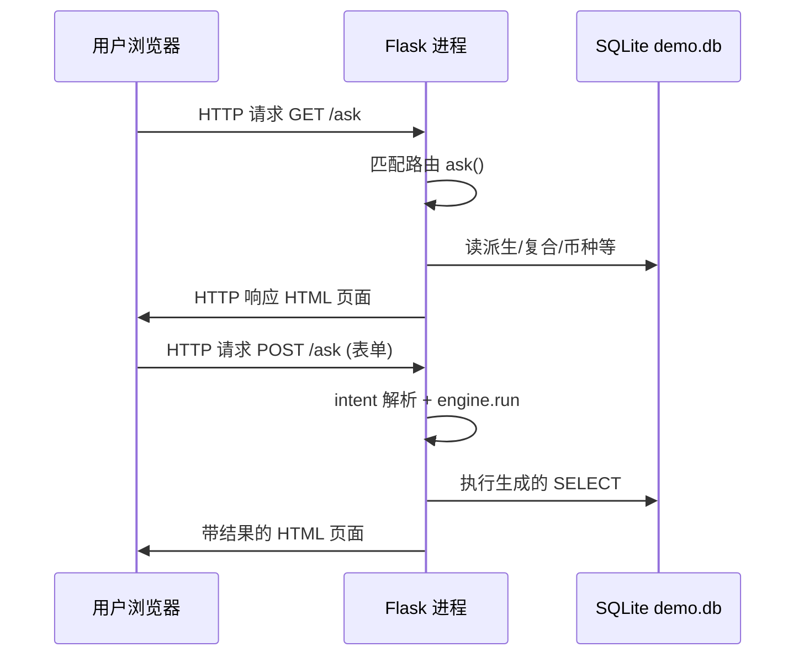

要点：

| 概念 | 含义 |
|---|---|
| **HTTP** | 浏览器与服务器之间的请求/响应协议 |
| **URL / 路径** | 如 `http://127.0.0.1:5050/ask` 中 `/ask` 决定进哪个处理函数 |
| **GET** | 通常用于「打开页面、查询」；参数可放在 URL `?q=xxx` |
| **POST** | 通常用于「提交表单、写库」；数据在请求体里 |
| **状态码** | 200 成功；302/303 重定向；400 客户端错误；500 服务端错误 |
| **无状态** | 每次请求彼此独立；本 Demo 用 `flash` + cookie 传一次性提示消息 |

### 2.2 什么是 Flask

Flask 是 Python 的**轻量 Web 框架**。相对 Django 等「全家桶」，Flask 默认只提供：

- 路由（URL → 函数）
- 请求/响应对象
- Jinja2 模板渲染
- 静态文件服务

本项目**没有**用 Flask Blueprint 拆包、没有登录中间件、没有 ORM——业务代码直接 `import db` / `import engine`。

最小心智模型：

```text
浏览器请求
  → Flask 找到 @app.route 对应的 Python 函数
  → 函数读 request（表单 / JSON / URL 参数）
  → 调业务模块（db / meta / engine …）
  → return render_template(...) 或 redirect(...) 或 jsonify(...)
```

### 2.3 本项目里会反复看到的 Flask API

| API | 作用 | 本仓库典型用法 |
|---|---|---|
| `Flask(__name__)` | 创建应用 | `app.py` 顶部 |
| `@app.route("/path")` | 注册路由 | 几乎所有页面 |
| `methods=["GET","POST"]` | 允许的 HTTP 方法 | 编辑页：GET 展示、POST 保存 |
| `request.form` | 读 HTML 表单字段 | 保存指标、问数表单 |
| `request.args` | 读 URL 查询参数 | 业务架构 `?parent_id=` |
| `request.get_json()` | 读 JSON 请求体 | SQL 预览 AJAX |
| `render_template(...)` | 渲染 `templates/*.html` | 返回页面 |
| `redirect(url_for(...))` | 302 跳转到具名路由 | 保存成功后回列表 |
| `url_for("atomic_list")` | 按函数名生成 URL | 模板导航、redirect |
| `flash(msg, category)` | 下一次请求显示提示 | 「已保存」「错误原因」 |
| `jsonify({...})` | 返回 JSON | `/preview-sql`、同名匹配 JOIN |
| `@app.before_request` | 每个请求前执行 | 自动 `db.init_db()` |
| `@app.template_filter` | 模板里可用的过滤器 | `zh_json` 中文 JSON |

### 2.4 Jinja2 模板（页面怎么拼出来）

`templates/base.html` 是壳子：顶栏 + ``。各业务页继承它：

```jinja

问数 Demo

  ... 本页 HTML ...

```

模板里 `{{ url_for('ask') }}`、`{{ row.name }}` 由服务端在渲染时填入。**业务逻辑不要写在模板里**——本项目把计算放在 Python，模板只做展示。

### 2.5 单体 Demo vs 前后端分离

| 模式 | 本 Demo | 常见生产形态 |
|---|---|---|
| 页面 | 服务端渲染 HTML | React/Vue SPA + JSON API |
| 写操作 | 表单 POST → redirect | `fetch` + REST |
| 会话 | 无登录；`secret_key` 仅用于 flash | JWT / Session / SSO |
| 部署 | `python app.py` 开发服务器 | gunicorn/uwsgi + nginx |

理解这一点很重要：你在浏览器里看到的每个列表/编辑页，几乎都是「一次请求换一整页 HTML」，只有少数预览接口返回 JSON。

### 2.6 SQLite 在本项目中的角色

- 文件：`data/demo.db`（首次启动自动创建）
- 既存**配置元数据**（指标、表字段、业务架构），也存**样例业务表**（事实宽表、项目维表）
- Python 用标准库 `sqlite3`，经 `db.get_conn()` 打开；`Row` 工厂让结果可用 `row["name"]` 访问

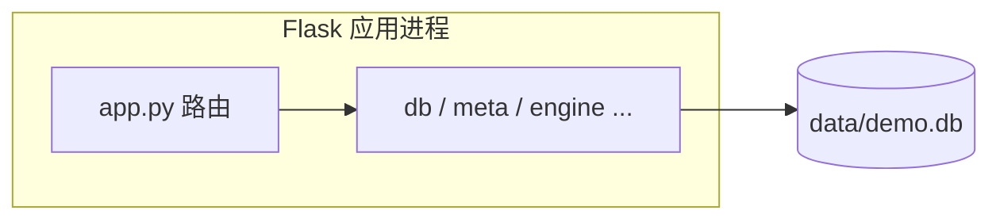

---

## 3. 系统总览

### 3.1 逻辑分层

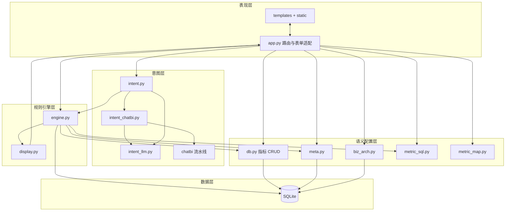

| 层 | 职责 | 禁止事项 |
|---|---|---|
| 表现层 | URL、表单、页面、flash | 不写业务口径 SQL |
| 意图层 | 文本/表单 → `Intent`；ChatBI 抽取/校验/消歧/会话 | **不生成业务 SQL、不查数仓** |
| 语义配置层 | 元数据 CRUD、预览 SQL 拼装 | 不问数执行的完整 JOIN/审计 |
| 规则引擎 | 校验、币种、JOIN、执行、审计 | 不解析自然语言 |
| 数据层 | 持久化与样例事实数据 | — |

### 3.2 两大产品能力

| 能力 | 入口 | 说明 |
|---|---|---|
| **配置中心** | 业务架构 / 元数据 / 维度关系 / 指标管理 / 指标地图 | 维护语义层，供引擎读取 |
| **问数 Demo** | `/ask` | 结构化表单或自然语言（ChatBI）→ 意图路由 → SQL/元数据/字典 + 中文审计 |

架构原则（与 [01](01_技术方案.md) 一致）：**AI/意图只出结构；口径与 SQL 由元数据 + 规则引擎生成。**

---

## 4. 目录与模块职责

```text
askdata/
├── app.py              # Flask 入口：全部路由、表单适配、预览 API
├── db.py               # SQLite 连接、建表/迁移/种子、指标 CRUD、维度绑定
├── meta.py             # 表/字段/关系元数据；分析维度；JOIN 解析
├── biz_arch.py         # 业务架构四级树
├── metric_sql.py       # 原子/派生 SQL 预览、过滤安全、CASE 包裹
├── metric_map.py       # 指标依赖树（复合向下展开）
├── engine.py           # 问数规则引擎：Intent → SQL → 执行 → EngineResult
├── intent.py           # 表单意图 / 自然语言 from_text（ChatBI 主链路）
├── intent_chatbi.py    # ChatBI → engine.Intent 适配；会话与能力引导
├── intent_llm.py       # 百炼调用、目录白名单、normalize、非查询/能力帮助
├── display.py          # 意图与审计的中文展示
├── chatbi/             # 企业级意图流水线（对标 Supersonic 思想）
│   ├── chat_workflow.py      # 编排：预处理→Mapper→解析→校验→记忆→路由
│   ├── semantic_parser.py    # LLM 解析 + Rule 兜底
│   ├── semantic_corrector.py # 指标/维度白名单、多指标消歧
│   ├── chat_memory.py        # 会话记忆（内存；可换 Redis）
│   ├── schemas.py            # IntentStruct / SchemaMapInfo / VerifyResult
│   ├── config.py             # Prompt 与本地字典占位
│   ├── llm_clients.py        # 百炼适配 / 强制规则 Client
│   ├── main.py               # 本地 Mock 测试入口
│   └── entity_mapper/        # 词典 Mapper + Embedding 占位
├── requirements.txt    # flask / openai / pydantic
├── static/style.css
├── templates/          # Jinja2 页面
├── data/demo.db        # 运行时生成（勿提交）
└── doc/                # 方案与设计文档
```

| 文件 | 对外核心能力 |
|---|---|
| `app.py` | Web 适配器；把 HTTP 转成对上述模块的调用 |
| `db.py` | `init_db` / `get_conn` / `upsert_*` / `list_*` / `metric_dim_bind` |
| `meta.py` | `upsert_meta_table` / `list_ask_analysis_fields` / `resolve_joins_for_tables` |
| `biz_arch.py` | `build_tree` / `upsert_node` / `taxonomy_catalog` |
| `metric_sql.py` | `build_atomic_sql_preview` / `build_derived_sql_preview` / `assert_executable_select` |
| `engine.py` | `run(Intent)` / `build_composite_sql_preview` |
| `intent.py` | `from_form` / `from_text`（默认 ChatBI，失败回退百炼/关键词） |
| `intent_chatbi.py` | `from_text_chatbi`：跑流水线并映射为 `Intent` |
| `intent_llm.py` | 目录组装、DashScope、`normalize_llm_payload`、`handle_non_query`、能力引导 |
| `chatbi/*` | Schema 实体匹配、语义抽取、校验消歧、会话、路由（不含 SQL） |
| `display.py` | `intent_zh` / `audit_zh` / `column_zh` / `dumps_zh` |
| `metric_map.py` | `build_metric_map()` |

依赖方向（理想上）：

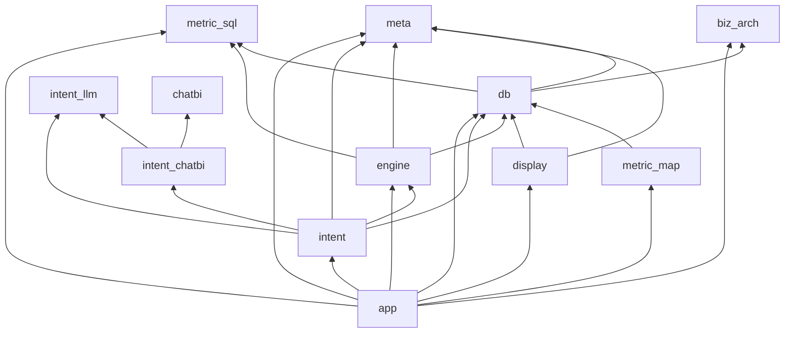

`app.py` 是唯一「知道 HTTP」的模块；引擎与配置层应可在无 Flask 环境下被单元调用（当前 Demo 以页面为主）。

---

## 5. 启动与生命周期

### 5.1 进程启动

```bash
python app.py
# 等价于：db.init_db() 后 app.run(host="127.0.0.1", port=5050, debug=True)
```

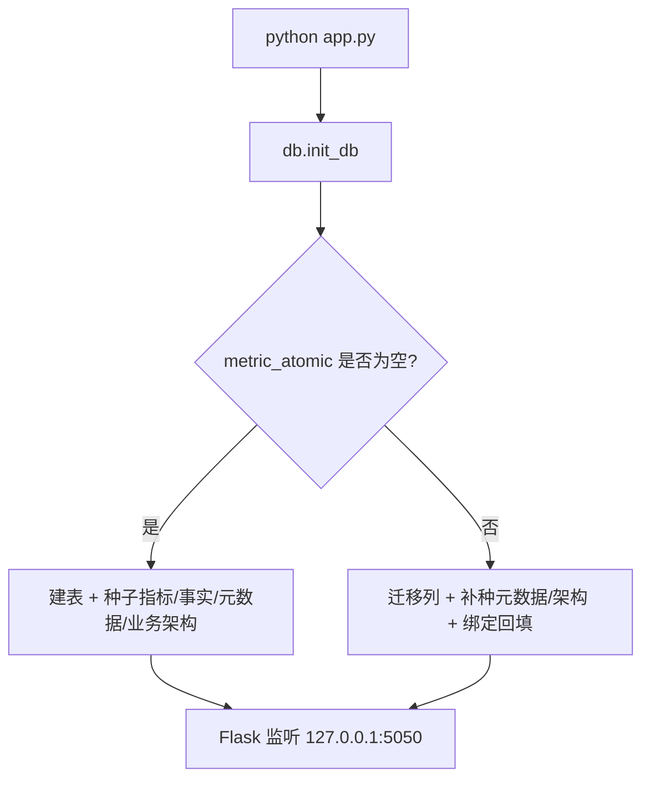

`init_db(force=True)`（首页「重建库」）会删除 `demo.db` 后全量重灌。

### 5.2 单次 HTTP 请求生命周期

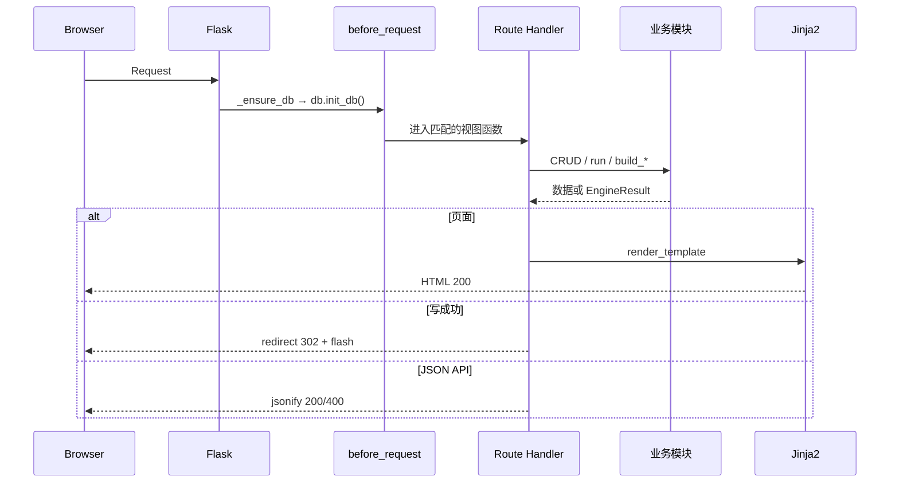

注意：`@app.before_request` 里每次请求都调用 `init_db()`。空库会灌种；已有库则做轻量迁移/补种。Demo 可接受；生产环境应改为显式迁移命令，避免热路径做 schema 工作。

### 5.3 开发服务器注意点

- `debug=True` 时默认有 reloader：改代码会自动重启。
- 若关闭 reloader，**改路由后必须手动重启**，否则可能出现 `BuildError: metrics_hub`（旧进程无新端点）。详见 [04](04_Demo实现与拆库说明.md)。

---

## 6. 路由与页面设计

### 6.1 信息架构（顶栏）

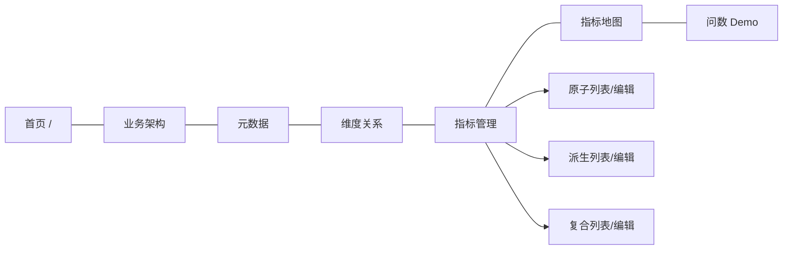

设计说明：顶栏**不再**并列三个指标类型入口，统一「指标管理」卡片页 + 列表内 Tab（`_metric_tabs.html`）。

### 6.2 路由分组

| 分组 | URL 前缀 | 视图函数前缀 | 说明 |
|---|---|---|---|
| 首页 | `/` | `index` | 统计卡片 |
| 指标中心 | `/metrics` | `metrics_hub` | 三类入口 |
| 原子 | `/metrics/atomic...` | `atomic_*` | CRUD + preview-sql |
| 派生 | `/metrics/derived...` | `derived_*` | CRUD + preview-sql |
| 复合 | `/metrics/composite...` | `composite_*` | CRUD + preview-sql |
| 指标地图 | `/metrics/map` | `metric_map_view` | 依赖树 |
| 业务架构 | `/meta/biz-arch...` | `biz_arch_*` | 树 + 批处理 |
| 表元数据 | `/meta/tables...` | `meta_table_*` | 表/字段/粒度 |
| 维度关系 | `/meta/rels...` | `meta_rel_*` | JOIN 配置 |
| 问数 | `/ask` | `ask` | GET 表单 / POST 执行 |
| 运维 | `/admin/reset` | `reset_db` | 强制重建库 |

### 6.3 典型页面交互模式（PRG）

编辑类页面统一采用 **Post/Redirect/Get**：

1. `GET /metrics/atomic/edit/<id>` → 渲染表单  
2. `POST` 同一 URL → `db.upsert_*` → `flash` → `redirect` 到列表  
3. 列表 `GET` 时展示 flash 消息  

好处：刷新列表不会重复提交；错误时停留编辑页并 `flash` 异常信息。

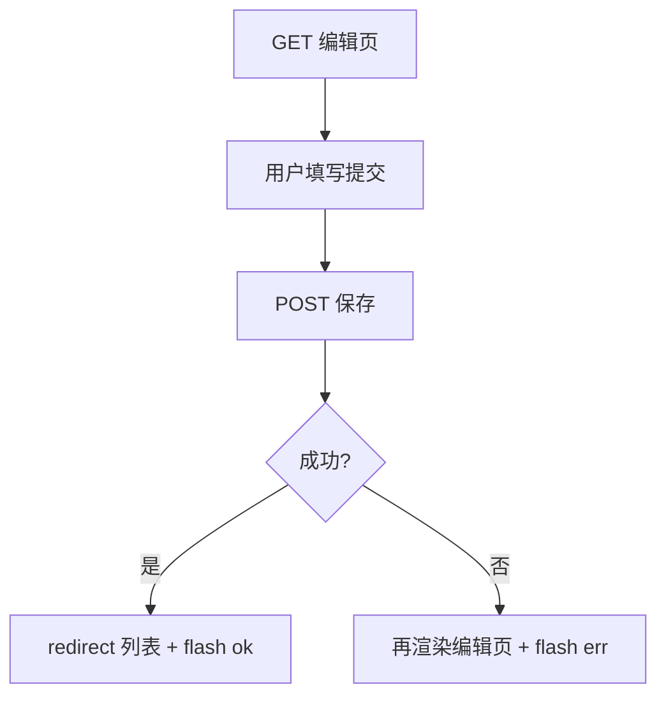

### 6.4 JSON 接口（局部增强）

下列接口返回 JSON，供页面内 JS 预览或辅助填写，**不替代**服务端渲染主流程：

| 路径 | 用途 |
|---|---|
| `POST /metrics/atomic/preview-sql` | 校验并执行原子 SQL（LIMIT 50） |
| `POST /metrics/derived/preview-sql` | 生成派生换算 SQL 并可选执行 |
| `POST /metrics/composite/preview-sql` | 展开复合公式 SQL 并可选执行 |
| `POST /meta/rels/match-keys` | 事实/维表同名字段自动匹配 JOIN 键 |

---

## 7. 模板与静态资源

### 7.1 模板清单

| 模板 | 用途 |
|---|---|
| `base.html` | 顶栏、flash、`` |
| `index.html` | 首页统计 |
| `metrics.html` | 指标管理总览卡片 |
| `_metric_tabs.html` | 原子/派生/复合列表 Tab |
| `_dim_bind.html` | 维度绑定多选（编辑页复用） |
| `_filters.html` | 过滤条件输入片段 |
| `atomic_*.html` / `derived_*.html` / `composite_*.html` | 列表与编辑 |
| `meta_table_*.html` / `meta_rel_*.html` | 元数据与关系 |
| `biz_arch.html` / `biz_arch_edit.html` | 业务架构 |
| `metric_map.html` | 依赖地图 |
| `ask.html` | 问数 Demo |

### 7.2 静态资源

- `static/style.css`：全局样式（含 metric-hub、compact 表等）
- 通过 `url_for('static', filename='style.css')` 引用；Flask 自动托管 `/static/...`

### 7.3 展示辅助

- 模板过滤器 `zh_json` → `display.dumps_zh`，便于在页面打印结构化中文 JSON。
- 问数页额外把 `intent` / `audit` / 列名转为中文视图（`intent_view`、`audit_view`、`col_headers`）。

---

## 8. 数据层设计（SQLite）

### 8.1 库内对象分类

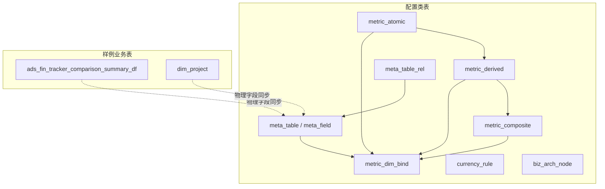

配置表与样例事实表**同库**，方便 Demo 一键执行；生产可拆：配置库 vs 数仓。

### 8.2 连接约定

```python
# db.get_conn()
sqlite3.connect(DB_PATH)
conn.row_factory = sqlite3.Row
PRAGMA foreign_keys = ON
```

路径：`Path(__file__).parent / "data" / "demo.db"`。

### 8.3 初始化与迁移策略

| 步骤 | 函数 | 说明 |
|---|---|---|
| 建指标等核心表 | `_create_schema` | `CREATE TABLE IF NOT EXISTS` |
| 建元数据/架构表 | `meta.ensure_schema` / `biz_arch.ensure_schema` | |
| 加列迁移 | `_migrate_schema` | `ALTER TABLE ... ADD COLUMN` |
| 空库灌种 | `_seed` + meta/biz 种子 + 默认绑定 | |
| 非空库 | backfill FX、补种、绑定迁移 | 兼容旧 Demo DB |

表字段含义详见 [03](03_元数据与配置模型.md)，本文不重复列级说明书。

---

## 9. 配置管理链路（CRUD）

### 9.1 推荐配置顺序


### 9.2 原子指标保存时序

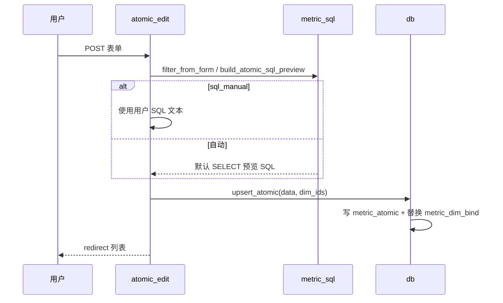

要点：

- 阶段金额/汇率在**原子层**维护（`stage_type`、`rate_col`）。
- 过滤尽量少写在原子；派生可叠加切片过滤。
- 维度绑定：`dim_ids` 来自可绑定 `meta_field`（`is_analysis_dim=1`）。

### 9.3 派生 / 复合要点

| 类型 | 保存时关键行为 |
|---|---|
| 派生 | 选定 `atomic_id`；金额/汇率/阶段在 upsert 时从原子继承；过滤存 `filter_json` |
| 复合 | `formula` + `sub_metric_ids`；可选校验币种/粒度一致；业务分类可从公式子指标推断默认值 |

### 9.4 元数据与 JOIN

- 保存表元数据时可 `sync_fields=True`，从物理表 `PRAGMA table_info` 同步字段。
- 维度关系存 `join_keys_list`（JSON）；问数时 `meta.resolve_joins_for_tables` 生成 `LEFT JOIN`。
- `match-keys` API：同名字段自动建议 JOIN 键，减少手工配置。

### 9.5 业务架构

四级：`biz_line` → `theme_domain` → `biz_object` → `biz_process`。  
指标编辑页通过 `biz_arch.taxonomy_catalog()` 拉下拉选项；删除节点前会检查是否被指标引用。

---

## 10. 问数链路详细设计

### 10.1 端到端流程

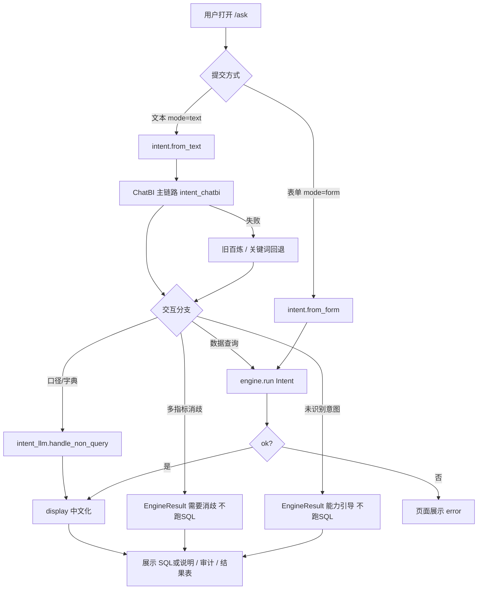

自然语言模式使用 Flask `session["ask_session_id"]` 作为 ChatBI 会话键，支撑多轮记忆（当前改写逻辑为占位，记忆已落库到进程内 `ChatMemory`）。

### 10.2 意图类型与路由分发

系统正式支持 **3 种**意图类型（`INTENT_TYPES` / `IntentStruct.意图类型` 白名单）：

| 意图类型 | 用户诉求 | 下游动作 | SQL？ |
|---|---|---|---|
| **数据查询** | 看指标数值、报表 | `engine.run` → 规则引擎拼 SQL 并执行 | 是 |
| **指标口径咨询** | 问定义/公式/口径/含义 | `handle_non_query` → 返回指标元数据审计 | 否 |
| **指标字典检索** | 有哪些指标/清单 | `handle_non_query` → 字典列表行 | 否 |

ChatBI 内部路由（`chatbi.chat_workflow.ChatBIWorkflow._route`）仅做分发，**不拼 SQL**：

| `route.action` | 含义 |
|---|---|
| `query_data` | 数据查询；可带 `metrics/dimensions/filter/currency/calc_cmd` |
| `query_metric_meta` | 口径咨询 |
| `list_metric` | 字典检索 |
| `unknown` | 未覆盖类型 → 能力引导（见 §10.5） |

`是否查询关联指标=true` 时：ChatBI 侧 `_get_metric_lineage` 为占位；真正血缘展开在 `intent_llm.normalize_llm_payload` / `lineage_related_ids`，把可查询关联指标并入 `metric_ids` 后交给引擎。

### 10.3 ChatBI 意图识别流水线（自然语言主链路）

设计对齐 Supersonic 思路：**用户问句 → 预处理 → Schema 实体 Mapper → LLM 语义抽取 → 元数据校验 → 会话记忆 → 意图路由**。边界明确：**只做意图，不做 SQL / 库查询**。

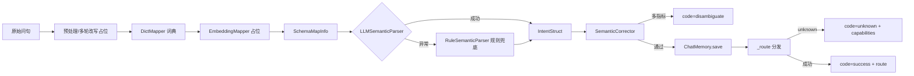

#### 10.3.1 模块职责

| 模块 | 职责 |
|---|---|
| `chatbi/chat_workflow.py` | 流水线编排；注入指标/维度字典与 system prompt |
| `entity_mapper/dict_mapper.py` | 指标/维度子串匹配、币种、阶段、项目编号 |
| `entity_mapper/embedding_mapper.py` | **向量召回占位**，本次不实现 ANN |
| `semantic_parser.py` | LLM JSON 抽取；失败降级规则（口径/字典/关联/TopN 关键词） |
| `semantic_corrector.py` | 指标白名单、维度合法性；多指标 → 消歧反问 |
| `chat_memory.py` | 按 `session_id` 内存保存最近 `IntentStruct`（可换 Redis） |
| `llm_clients.py` | `BailianChatClient` / `ForceRuleLLMClient` |
| `intent_chatbi.py` | 拉平台 catalog、跑 workflow、映射为 `engine.Intent` |
| `intent.py` | `from_text` 入口：`INTENT_PROVIDER` 控制主链路与回退 |

#### 10.3.2 Provider 与降级

| `INTENT_PROVIDER` | 行为 |
|---|---|
| `auto`（默认）/ `chatbi` / `bailian` | **优先 ChatBI**；ChatBI 异常再回退旧百炼（若配置）或关键词 |
| `keyword` | 仅关键词 `from_text_keywords` |

ChatBI 内部 LLM：

- 已配置 `DASHSCOPE_API_KEY` → `BailianChatClient`（`intent_llm.call_bailian_raw`）
- 未配置 → `ForceRuleLLMClient` 主动抛错，触发 **RuleSemanticParser** 兜底

日志埋点（`logging`）：原始问句、Mapper 候选、意图输出、校验告警、消歧/unknown、会话保存。

#### 10.3.3 本地单测入口

```bash
pip install pydantic
python -m chatbi.main --batch   # 或 cd chatbi && python main.py
```

`chatbi/main.py` 内置 `MockLLMClient`，无需真实大模型即可跑通整套链路。

### 10.4 Intent / IntentStruct 与历史 JSON 兼容

#### ChatBI 中间结构 `IntentStruct`（Pydantic）

与问数页 `payload_zh` / 历史百炼 JSON 字段对齐：

```text
意图来源, 意图类型, 指标[], 币种, 分析维度[], 筛选条件{},
计算指令, 是否查询关联指标, 原始问句
```

`SchemaMapInfo`：`metric_candidates` / `dim_candidates` / `filter_candidates` / `currency_candidate`。  
`VerifyResult`：`intent` + `warning_msg` + `need_disambiguate`。

#### 引擎结构 `engine.Intent`（dataclass）

```python
@dataclass
class Intent:
    metric_ids: list[str]
    currency: str                 # CNY / USD / ORIGIN
    dims: list[str]               # 分析维度 code
    filters: dict[str, str]
    raw_text: str
    source: str                   # form | keyword | bailian | chatbi
    intent_type: str              # 三类之一
    include_related: bool
    calc_instruction: str | None
    metric_names: list[str]
    related_metric_ids: list[str]
    payload_zh: dict              # 中文意图回显
    disambiguate_msg: str | None  # 多指标消歧文案
    capability_help_msg: str | None  # 未识别时的能力引导
```

映射路径：`IntentStruct` → `normalize_llm_payload`（名称→ID、币种、维度 code、筛选规范化、血缘展开）→ `Intent`。  
**禁止模型直接写 SQL**；SQL 仅由 `engine.run` 生成。

### 10.5 消歧、能力引导与非查询处理

`/ask` POST（`mode=text`）在调用引擎前统一拦截：

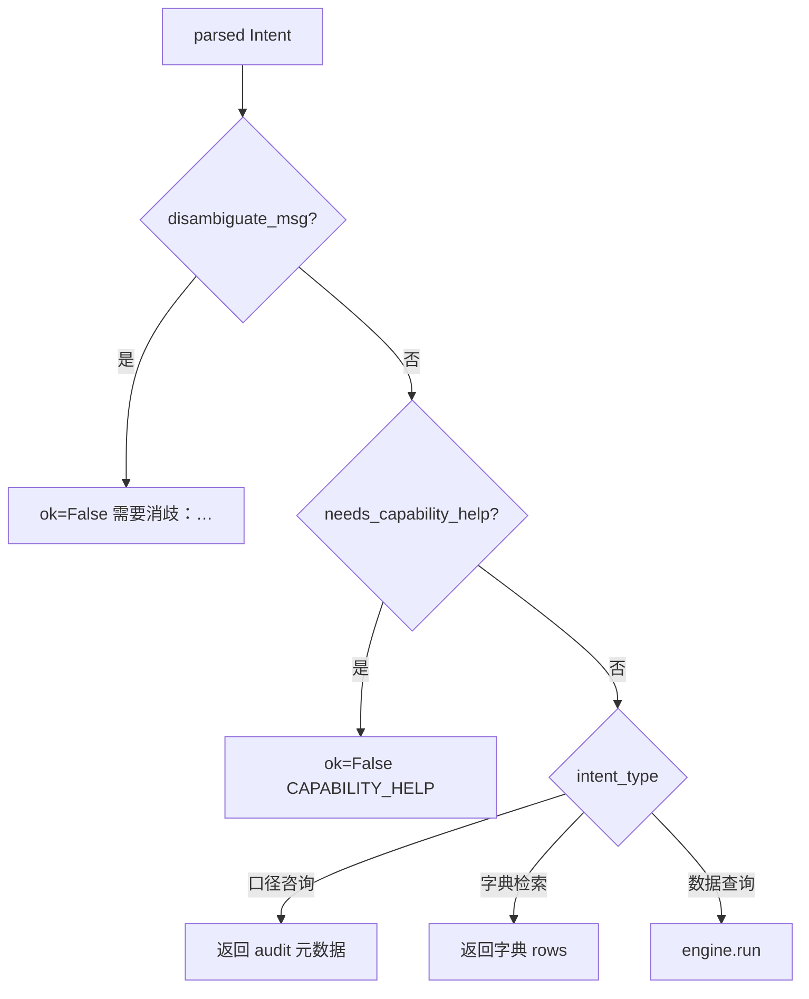

**多指标消歧**：`SemanticCorrector` 在白名单内命中 `>1` 个指标 → `need_disambiguate`；页面错误框提示「请问您需要查询哪一项？」，**不执行 SQL**。

**能力引导**（`intent_llm.CAPABILITY_HELP`）触发条件：

1. ChatBI `route.action == unknown` / `code == unknown`
2. `intent_type` 不在三类白名单
3. **数据查询但指标为空**（如闲聊、指标名不在字典）

文案固定告知可支持的三类能力（数据查询 / 口径咨询 / 字典检索）。

**口径咨询元数据**：`handle_non_query` 按复合/派生/原子组装 `audit`（公式、阶段、金额/汇率字段等），`sql=""`，页面展示「不生成业务 SQL」。

### 10.6 引擎主路径与结果展示

#### 引擎主路径（与代码 `engine.run` 对齐）

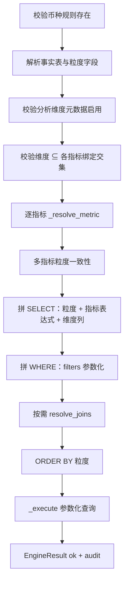

失败时返回 `EngineResult(ok=False, error=...)`，**不执行**或中止拼装，保证「错口径不出数」。

#### 结果展示

| 字段 | 含义 |
|---|---|
| `sql` | 最终可执行 SELECT（口径/字典/消歧/能力引导时为空） |
| `audit` | 每指标解析树或口径元数据 |
| `columns` / `rows` | 查询结果或字典行 |
| `intent` / `payload_zh` | 结构化意图回显（含意图来源如「ChatBI意图流水线」） |
| `error` | 消歧文案、能力引导、引擎错误等 |

`display.py` 把上述结构转成中文标签，供 `ask.html` 展示；`source=chatbi` 映射为「ChatBI意图流水线」。

---
## 11. 规则引擎内部设计

### 11.1 指标解析递归

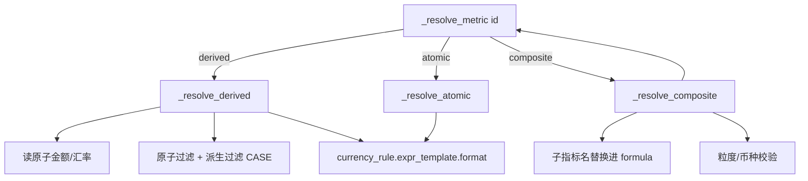

复合指标硬规则（与 [02](02_计算与币种规则.md) 一致）：

- **先各子指标独立按本阶段汇率换算，再四则运算**
- 禁止跨阶段汇率混用（`_same_stage_prefix`）
- 可选：子指标粒度一致、币种一致

### 11.2 币种注入

`currency_rule.expr_template` 使用占位符 `{amount}`、`{rate}`，例如人民币侧为金额×汇率类表达式。引擎在 resolve 阶段注入，而不是在配置里写死某币种 SQL。

### 11.3 JOIN 与别名

| 角色 | 别名策略 |
|---|---|
| 事实表 | 固定 `m`（`FACT_ALIAS`） |
| 维度表 | `meta.dim_alias_for(physical_name)` |

仅当 SELECT/WHERE 引用了维表字段时才加入 `needed_tables`，再解析关系；缺关系则报错，避免隐式笛卡尔积。

### 11.4 参数化过滤

用户筛选值进入 `params` 列表，SQL 使用 `?` 占位，由 `sqlite3` 绑定，降低注入风险。指标配置里的过滤文本另有 `assert_safe_filter`（禁止 `;`、注释符）。

---

## 12. SQL 预览与安全边界

### 12.1 配置页预览 vs 问数执行

| | 配置预览 | 问数 `engine.run` |
|---|---|---|
| 入口 | `*/preview-sql` | `/ask` POST |
| SQL 来源 | `metric_sql` 或 `build_composite_sql_preview` | 完整引擎拼装（含 JOIN/WHERE/多指标） |
| 执行 | 可选；外包 `LIMIT 50` | 完整结果（Demo 数据量小） |
| 审计 | 无完整审计树 | 有 |

### 12.2 安全闸门（Demo 级）

| 检查 | 位置 |
|---|---|
| 过滤禁止 `;` `--` `/* */` | `metric_sql.assert_safe_filter` |
| 仅允许可执行 SELECT | `assert_executable_select` |
| 标识符正则 | 字段名、维度字段 |
| 复合展开后字符白名单 | `_resolve_composite` |
| 预览强制 LIMIT | `app.py` 包装子查询 |

这不是完整 SQL 防火墙；生产应使用只读账号、语句超时、更严的 AST 校验。

---

## 13. 关键数据结构

### 13.1 `EngineResult`

```python
@dataclass
class EngineResult:
    ok: bool
    sql: str = ""
    intent: dict = field(default_factory=dict)
    audit: list[dict] = field(default_factory=list)
    columns: list[str] = field(default_factory=list)
    rows: list[list] = field(default_factory=list)
    error: str = ""
```

### 13.2 `Intent`（引擎入参，见 §10.4）

除 `metric_ids/currency/dims/filters/raw_text` 外，自然语言链路还会填充：

| 字段 | 说明 |
|---|---|
| `source` | `form` / `keyword` / `bailian` / `chatbi` |
| `intent_type` | 数据查询 / 指标口径咨询 / 指标字典检索 |
| `include_related` / `related_metric_ids` | 关联血缘 |
| `payload_zh` | 中文 Intent JSON，供 UI 原样展示 |
| `disambiguate_msg` | 多指标消歧 |
| `capability_help_msg` | 未识别意图时的三类能力引导 |

ChatBI 中间态另见 `chatbi.schemas.IntentStruct` / `SchemaMapInfo` / `VerifyResult`。

### 13.3 审计节点（示意）

派生示例字段：`type/name/stage_type/amount_col/rate_col/expr/grain/...`  
复合示例字段：`formula/expanded_expr/children/note`（note 固定提示「先各阶段独立换算，再四则运算」）  
口径咨询：同结构但 `note` 标明「口径咨询（不执行数值查询）」，`sql` 为空。

### 13.4 指标地图返回

`metric_map.build_metric_map()` → `{ trees, orphans, stats }`：

- `trees`：以复合为根向下展开
- `orphans`：未被复合引用的派生/原子等
- 用于配置可视化合规，不参与 SQL 执行

---

## 14. 扩展与改造指南

| 目标 | 建议改动点 | 不要做的事 |
|---|---|---|
| 接入真实大模型 | 已实现：ChatBI + `BailianChatClient` / `intent_llm`；输出仍为 `Intent` | 让模型生成业务 SQL |
| 接入向量召回 | 实现 `EmbeddingMapper.match`（embedding + ANN） | 绕过白名单模糊编造指标名 |
| 指标血缘服务 | 注入 `ChatBIWorkflow(lineage_fn=...)` 或扩展 `lineage_related_ids` | 在 LLM 侧展开全库指标 |
| 会话持久化 | 将 `ChatMemory` 换为 Redis | 在无 session 时跨用户串记忆 |
| 接 MaxCompute/数仓 | 替换 `engine._execute` 与连接配置 | 改口径拼装规则绕过元数据 |
| 拆前后端 | `app.py` 增加 JSON API，复用 `run`/`from_text`/`upsert_*` | 在前端重写汇率逻辑 |
| 多应用模块化 | 按域拆 Flask Blueprint（meta/metrics/ask） | 在模板里写校验 |
| 权限 | 加登录中间件保护写路由与 `/admin/reset` | 暴露强制重建给公网 |
| 配置与事实分库 | `db.get_conn` 与执行连接分离 | 引擎写临时业务表充当口径 |

### 14.1 本地验证清单

1. 启动后打开 `http://127.0.0.1:5050`
2. 指标管理三类列表可打开；编辑保存有 flash
3. 问数表单：成本 GAP + CNY + 电站 + `P001` → GAP **1540**（见 [02](02_计算与币种规则.md)）
4. 自然语言：选「自然语言（ChatBI / 回退）」  
   - 「…成本GAP以及其他相关…」→ 意图来源 ChatBI，生成 SQL  
   - 「成本GAP指标口径是什么？」→ 口径元数据，无业务 SQL  
   - 「成本GAP和PJ成本金额」→ 消歧提示  
   - 「今天天气怎么样」→ 三类能力引导  
5. 审计中可见各阶段金额列与对应汇率列，且先换算再相减
6. 可选：`python -m chatbi.main --batch` 无 Key 跑通意图流水线

---
## 15. 附录：路由速查表

| 方法 | 路径 | 视图函数 | 说明 |
|---|---|---|---|
| GET | `/` | `index` | 首页 |
| GET | `/metrics` | `metrics_hub` | 指标管理总览 |
| GET | `/metrics/atomic` | `atomic_list` | 原子列表 |
| GET/POST | `/metrics/atomic/edit`[`/<id>`] | `atomic_edit` | 原子编辑 |
| POST | `/metrics/atomic/preview-sql` | `atomic_preview_sql` | 预览执行 |
| POST | `/metrics/atomic/delete/<id>` | `atomic_delete` | 删除 |
| GET | `/metrics/derived` | `derived_list` | 派生列表 |
| GET/POST | `/metrics/derived/edit`[`/<id>`] | `derived_edit` | 派生编辑 |
| POST | `/metrics/derived/preview-sql` | `derived_preview_sql` | 预览 |
| POST | `/metrics/derived/delete/<id>` | `derived_delete` | 删除 |
| GET | `/metrics/composite` | `composite_list` | 复合列表 |
| GET/POST | `/metrics/composite/edit`[`/<id>`] | `composite_edit` | 复合编辑 |
| POST | `/metrics/composite/preview-sql` | `composite_preview_sql` | 预览 |
| POST | `/metrics/composite/delete/<id>` | `composite_delete` | 删除 |
| GET | `/metrics/map` | `metric_map_view` | 指标地图 |
| GET | `/meta/biz-arch` | `biz_arch_view` | 架构树 |
| GET/POST | `/meta/biz-arch/edit`[`/<id>`] | `biz_arch_edit` | 节点编辑 |
| POST | `/meta/biz-arch/batch` | `biz_arch_batch` | 批量启停删 |
| POST | `/meta/biz-arch/toggle/<id>` | `biz_arch_toggle` | 启停 |
| POST | `/meta/biz-arch/delete/<id>` | `biz_arch_delete` | 删除 |
| GET | `/meta/tables` | `meta_table_list` | 表列表 |
| GET/POST | `/meta/tables/edit`[`/<id>`] | `meta_table_edit` | 表编辑 |
| POST | `/meta/tables/sync-fields/<id>` | `meta_table_sync_fields` | 同步字段 |
| POST | `/meta/tables/delete/<id>` | `meta_table_delete` | 删表元数据 |
| POST | `/meta/fields/update/<id>` | `meta_field_update` | 更新字段语义 |
| GET | `/meta/rels` | `meta_rel_list` | 关系列表 |
| GET/POST | `/meta/rels/edit`[`/<id>`] | `meta_rel_edit` | 关系编辑 |
| POST | `/meta/rels/match-keys` | `meta_rel_match_keys` | 同名键匹配 |
| POST | `/meta/rels/delete/<id>` | `meta_rel_delete` | 删除关系 |
| GET/POST | `/ask` | `ask` | 问数 Demo |
| POST | `/admin/reset` | `reset_db` | 重建数据库 |

---

## 关联文档

- [01_技术方案.md](01_技术方案.md) — 架构原则与禁止规则  
- [02_计算与币种规则.md](02_计算与币种规则.md) — 五阶段汇率与验算  
- [03_元数据与配置模型.md](03_元数据与配置模型.md) — 表结构与绑定  
- [04_Demo实现与拆库说明.md](04_Demo实现与拆库说明.md) — 代码映射与独立建库  

---

*本文描述以当前仓库 `app.py` 及同级模块为准；若路由或表结构变更，请同步更新本文件与 [04](04_Demo实现与拆库说明.md)。*
