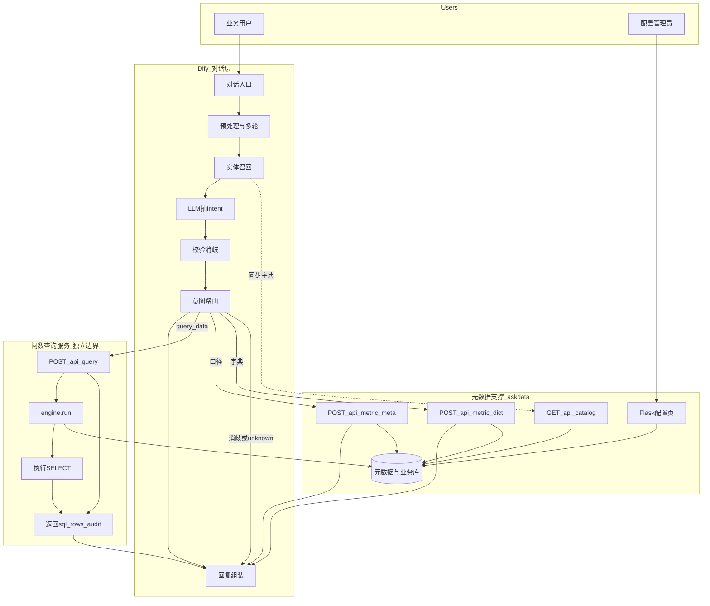
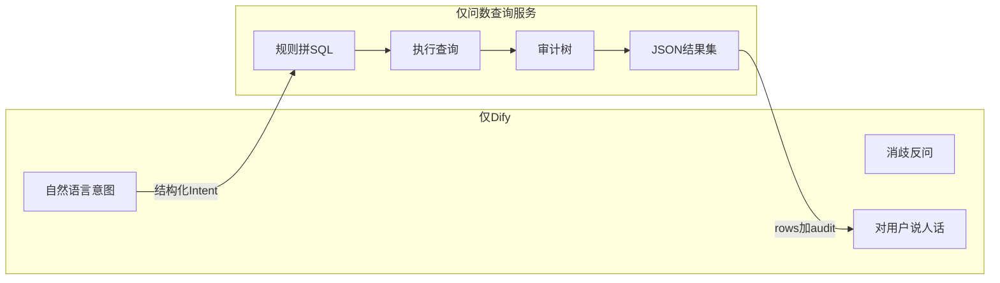
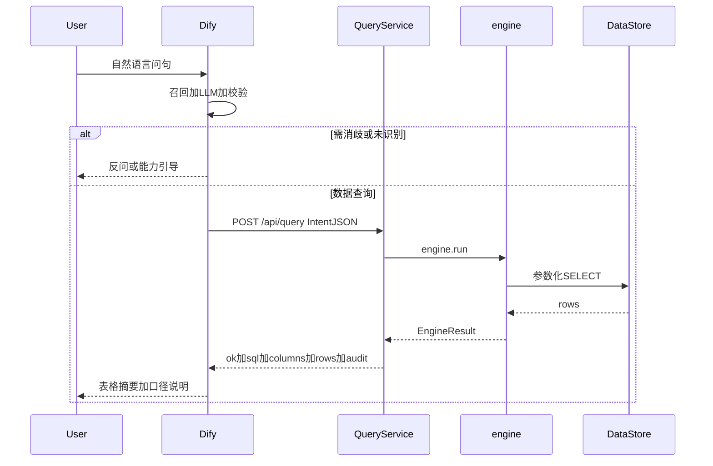
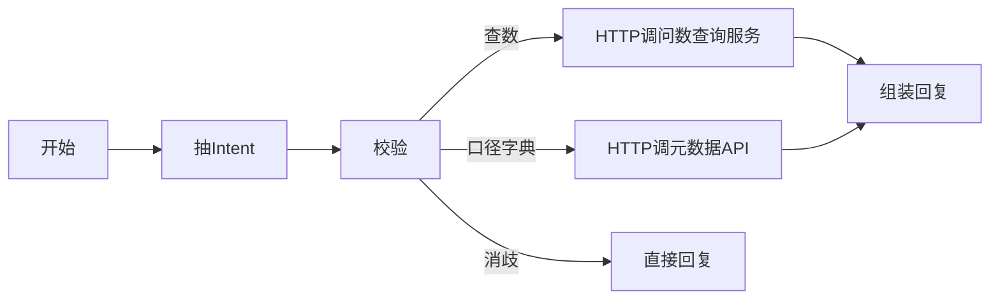
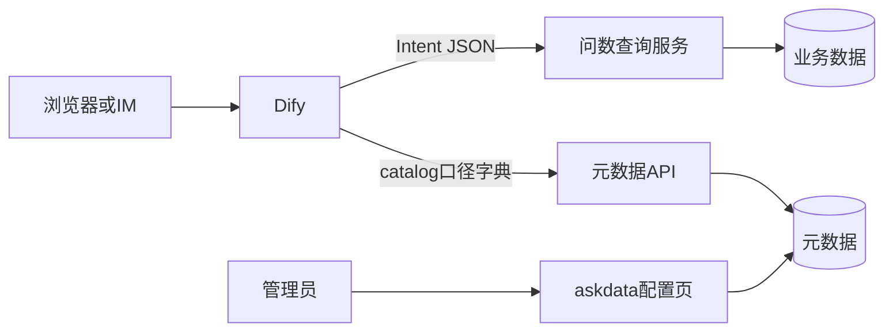
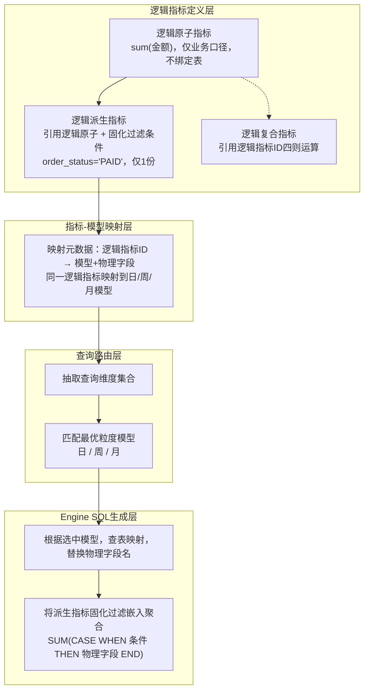

# 06 · 需求规划一：Dify 对话层 + 问数查询服务

> 规划文档（非详细设计实现说明）。对齐现有技术方案红线：**AI 只解析意图；SQL 由规则引擎生成并执行**。  
> 关联：[01_技术方案](01_技术方案.md) · [05_详细设计_Flask与实现](05_详细设计_Flask与实现.md)

---

## 1. 背景与目标

当前 Demo 在 Flask 单体中完成：ChatBI 意图流水线 → 消歧/分流 → `engine.run` 拼 SQL 并执行 → 页面展示。

规划将对话入口迁到 **Dify**，同时把 **数据查询的执行与结果返回** 明确为独立服务边界（问数查询服务），便于：

- 对话编排与财务口径引擎解耦
- 禁止 NL2SQL，契约稳定（Intent JSON ↔ EngineResult JSON）
- 日后查询服务可单独扩缩容、换数仓执行层

## 2. 三层分工

| 层 | 职责 | 不做什么 |
|---|---|---|
| **Dify（对话层）** | 对话、多轮、实体召回、LLM 抽意图、消歧/能力引导、调用下游、润色回复 | 不连业务库、不生成 SQL、不执行查询 |
| **问数查询服务** | 接收结构化 Intent → 规则引擎拼 SQL → 执行 → 返回 `sql` / `rows` / `audit` / `error` | 不做自然语言理解 |
| **配置/元数据（askdata 管理台）** | 指标/维度/表关系 CRUD、口径真相源；提供 catalog / 口径 / 字典 API | 不作为用户主对话入口 |

**结论：数据查询的执行由「问数查询服务」提供；Dify 只通过 HTTP 调用并展示结果。**

Demo 阶段查询服务可与 askdata **同仓同进程**挂 `/api/query`；逻辑与部署边界按独立服务设计。

## 3. 总体架构



## 4. 职责切分



| 现有模块 | 规划归属 |
|---|---|
| `chatbi/` 意图流水线 | Dify Chatflow（召回 / LLM / 校验 / 路由） |
| `engine.run` | **问数查询服务** |
| `handle_non_query`（口径/字典） | 元数据 API（askdata） |
| Flask 配置 CRUD | 管理台，保持现状 |
| `/ask` 页面 | Demo 可保留；生产对话入口切 Dify |

## 5. 数据查询时序



口径咨询 / 字典检索走元数据 API（无业务 SQL、不查数）；**只有「要出数」才调用问数查询服务。**

## 6. 接口规划

### 6.1 问数查询服务（执行与返回）

| 接口 | 作用 |
|---|---|
| `POST /api/query` | Intent → `engine.run` → 返回结果 |
| `GET /api/health` | 探活 |

### 6.2 元数据支撑（给 Dify）

| 接口 | 作用 |
|---|---|
| `GET /api/catalog` | 指标/维度字典，供 Prompt 或知识库同步 |
| `POST /api/metric-meta` | 口径咨询 |
| `POST /api/metric-dict` | 指标清单 |

### 6.3 统一响应（对齐 `EngineResult`）

```json
{
  "ok": true,
  "sql": "SELECT ...",
  "columns": ["..."],
  "rows": [[...]],
  "audit": [{ "...": "中文口径" }],
  "intent": {},
  "error": ""
}
```

### 6.4 `/api/query` 入参示例

```json
{
  "metric_ids": ["d_pj_total_cost"],
  "metric_names": ["PJ总成本"],
  "currency": "CNY",
  "dims": ["power_plant"],
  "filters": {"project_number": "P001"},
  "include_related": false,
  "raw_text": "用户原句"
}
```

### 6.5 约束

- 鉴权：请求头 `X-API-Key`
- 拒绝 SQL 字符串入参；只收结构化 Intent
- 查询强制 `LIMIT`（如 200）
- 内部复用现有 `engine.run`，不改财务口径与汇率规则

## 7. Dify Chatflow 编排要点



- Intent 字段对齐现有 `IntentStruct` / `payload_zh`（意图类型、指标、币种、维度、筛选等）
- 多指标消歧、未识别能力引导在 Dify 内完成，**不调用** `/api/query`
- 对查询服务返回只做展示编排，不二次改口径、不重算指标

## 8. 部署关系



| 阶段 | 形态 |
|---|---|
| Demo | QuerySvc 与 MetaAPI、ConfigUI 同进程（askdata） |
| 演进 | QuerySvc 独立部署扩缩容；换 MaxCompute/数仓只改查询服务执行层，Dify 契约不变 |

## 9. 实施顺序

1. 实现 `/api/query` + `/api/health`（问数查询服务边界）
2. 实现 `/api/catalog`、`/api/metric-meta`、`/api/metric-dict`
3. API Key、LIMIT、入参白名单
4. Dify Chatflow 对接（查数只调问数查询服务）
5. 在详细设计中补充对接说明与联调记录

## 10. 明确不做

- Dify 内 NL2SQL，或 Dify 直连业务库查数
- 把派生/复合/汇率规则搬进 Dify 代码节点
- 用本规划替换现有配置管理 UI

---

**状态**：需求规划（待开发）  
**文档编号**：需求规划一

## 11. 指标物理层映射（多物理表）— 演进思路

> **状态**：规划中，**当前 Demo 未实现**。现网原子指标仍直接绑定 `source_table` / `source_field`（见 [03](03_元数据与配置模型.md)）。本节描述「逻辑口径」与「物理模型」解耦后，同一逻辑指标可映射日/周/月等多粒度表的目标形态，供查询服务路由选型。

与当前已实现能力的关系：

| 层次 | 现状（Demo） | 本节规划 |
|---|---|---|
| 逻辑口径 | 原子/派生/复合已分层配置 | 保持：一份逻辑定义 |
| 物理绑定 | 原子上直接写表字段 | 拆出「指标↔模型映射」元数据 |
| 查询路由 | 固定主事实表 + 维度 JOIN | 按查询维度集合选最优粒度模型 |
| 可视化 | 指标地图按**业务架构**挂依赖（已落地） | 映射层不改变依赖地图语义 |



实施时注意：映射与路由落在**问数查询服务 / Engine**，不进入 Dify；逻辑层仍遵守 [07](07_指标分层_理论配置与SQL生成.md) 的原子/派生/复合规则。
