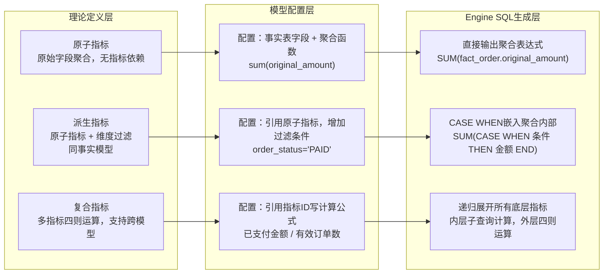
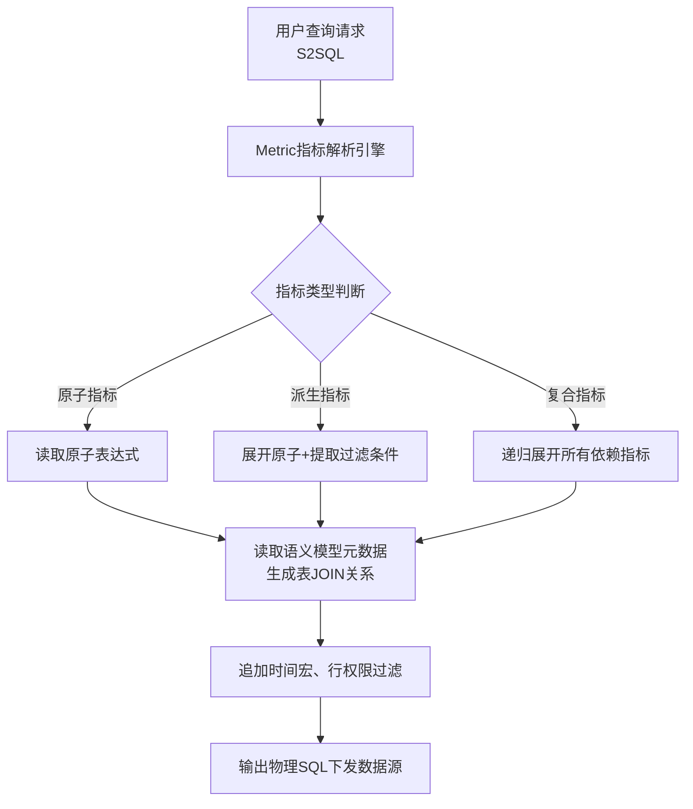

# 07 · 指标分层：理论 · 配置 · SQL 生成

> 一张图讲清原子 / 派生 / 复合：理论定义、配置落地、引擎生成思路。  
> 关联：[01_技术方案](01_技术方案.md) · [02_计算与币种规则](02_计算与币种规则.md) · [03_元数据与配置模型](03_元数据与配置模型.md)

---

## 1. 交互流程图

打开可交互图（暗/亮主题、导出 PNG）：

**[diagrams/metric-layers.html](diagrams/metric-layers.html)**

源规范：[diagrams/metric-layers.workflow.json](diagrams/metric-layers.workflow.json) 

---

## 原子 / 派生 / 复合指标｜理论 - 配置 - 引擎 SQL 生成 三栏对照 + 流程图

> 适用：OneData + SuperSonic 语义引擎体系；纵向三栏：**【理论定义】｜【实操配置】｜【Engine SQL 生成逻辑】** 流程图分为两层：**指标定义层（业务建模） → SQL 引擎翻译层**

## 一、三栏对照表（原子指标 / 派生指标 / 复合指标）

表格


| 指标类型                        | 【理论定义】                                                                                                                    | 【实操落地配置（语义模型）】                                                                                                              | 【Engine SQL 生成思路】                                                                                                                                                                                                                                   |
| --------------------------- | ------------------------------------------------------------------------------------------------------------------------- | --------------------------------------------------------------------------------------------------------------------------- | --------------------------------------------------------------------------------------------------------------------------------------------------------------------------------------------------------------------------------------------------- |
| ✅ **原子指标 Atomic Metric**    | 业务最基础、不可再拆分的度量；直接取自事实表原始字段，**不含其他指标引用**。本质：对原始字段做聚合函数（sum/count/avg/max/min）。例：订单原始金额、订单数、支付用户数                           | 1. 绑定**事实表字段**2. 配置聚合函数：sum、count_distinct 等3. 不引用任何其他指标4. 口径描述：原始字段聚合示例配置：指标名：订单金额表达式：`sum(original_amount)`来源表：fact_order | 1. 直接把配置的聚合表达式塞进 SELECT2. 无递归展开3. 维度分组自动加 GROUP BY生成片段：`SUM(fact_order.original_amount) AS 订单金额`                                                                                                                                                    |
| ✅ **派生指标 Derived Metric**   | 基于**原子指标 + 维度筛选条件**，在同一事实模型上增加过滤条件得到；**引用原子指标，不引用其他派生 / 复合指标**。公式 = 原子指标 + 筛选 where 条件例：已支付订单金额（订单金额【原子】+ 支付状态 = 已支付）     | 1. 选择依赖的**原子指标**2. 增加筛选条件（维度过滤）3. 限定在同一个事实模型示例配置：指标名：已支付订单金额依赖指标：订单金额 (原子)筛选条件：`order_status = 'PAID'`                      | 1. 取出底层原子表达式2. 将筛选条件并入 WHERE / CASE WHEN3. 同模型无需额外 JOIN生成片段：`SUM(CASE WHEN fact_order.order_status='PAID' THEN fact_order.original_amount END) AS 已支付订单金额`                                                                                          |
| ✅ **复合指标 Composite Metric** | 由**原子 / 派生指标做四则运算**得到；可以跨指标、跨模型，**公式由多个已定义指标组合计算**。公式 = A 指标 op B 指标（A/B、A-B、A*B）例：支付转化率 = 支付用户数 / 访问用户数；客单价 = 支付金额 / 订单数 | 1. 选择多个底层指标（原子 / 派生均可）2. 填写指标间四则表达式，**引用指标 ID，不是原始表字段**3. 引擎自动识别多个指标对应的模型，自动关联模型示例配置：指标名：客单价表达式：`已支付订单金额 / 有效订单数`           | 1. 递归展开所有依赖指标到最底层原子表达式2. 多模型自动生成 JOIN；同模型则在同一子查询内3. 外层 SELECT 做指标四则运算生成思路：内层子查询算出两个指标，外层相除`sql<br>SELECT paid_amount / order_cnt AS 客单价<br>FROM (<br> SELECT SUM(CASE ...) AS paid_amount, COUNT(...) AS order_cnt<br> FROM fact_order<br>) t1<br>` |


> 关键区分一句话：
>
> - 原子：**原始字段聚合**
> - 派生：**原子 + 过滤**（不做指标相除 / 加减）
> - 复合：**指标和指标运算**

# 二、纵向流程图（文本 Mermaid，可直接复制到 Mermaid 渲染器）

> 布局逻辑：**三列并行，从左到右：理论层 → 模型配置层 → Engine SQL 生成层**




# 三、完整端到端总流程（S2SQL→引擎展开→物理 SQL）




# 四、三套完整 SQL 样例对照

### 1）原子指标：订单金额

**配置表达式**：`sum(original_amount)`  
==也可以sum 和表字段分拆配置，然后生成预览SQL

```sql
SELECT
  SUM(fact_order.original_amount) AS `订单金额`
FROM fact_order
WHERE dt >= '2026-01-01'

```

### 2）派生指标：已支付订单金额

**配置：依赖【订单金额】+ order_status='PAID'**  
基于原子指标sql改造生成SQL

```sql
SELECT
  SUM(CASE WHEN fact_order.order_status = 'PAID' THEN fact_order.original_amount END)
FROM fact_order
WHERE dt >= '2026-01-01'

```

### 3）复合指标：客单价 = 已支付订单金额 / 有效订单数

**配置表达式：`已支付订单金额 / 有效订单数  
基于原子指标和派生指标的过滤规则生成SQL

```sql
  SELECT  CASE WHEN t.valid_order_cnt=0 THEN 0 ELSE t.paid_amt/t.valid_order_cnt END
  FROM (SELECT
    SUM(CASE WHEN fact_order.order_status = 'PAID' THEN fact_order.original_amount END) AS paid_amt,COUNT(DISTINCT fact_order.order_id) AS valid_order_cnt
  FROM fact_order
  WHERE dt >= '2026-01-01'
  ) t

```

# 五、引擎关键规则（开发重点）

1. **递归展开终止条件**：遇到原子指标停止递归，防止循环依赖（必须做环检测）
2. **派生指标实现优先 CASE WHEN**，不单独 WHERE，避免过滤掉其他同查询指标
3. **复合指标统一放到外层计算**，保证分母为 0 时可增加 NULLIF 做保护 `paid_amt / NULLIF(valid_order_cnt,0)`
4. 多模型复合指标：引擎自动根据模型关联关系生成 JOIN，把多个模型指标汇总到同一子查询

如果你想要，我可以：

1. 输出可直接放到 markdown 的高清 Mermaid 图（横向排版，适合文档）
2. 写指标递归展开的伪代码（MetricResolveEngine）
3. 增加**校验规则清单**：建模时原子 / 派生 / 复合的校验规则，用于前端配置校验。

